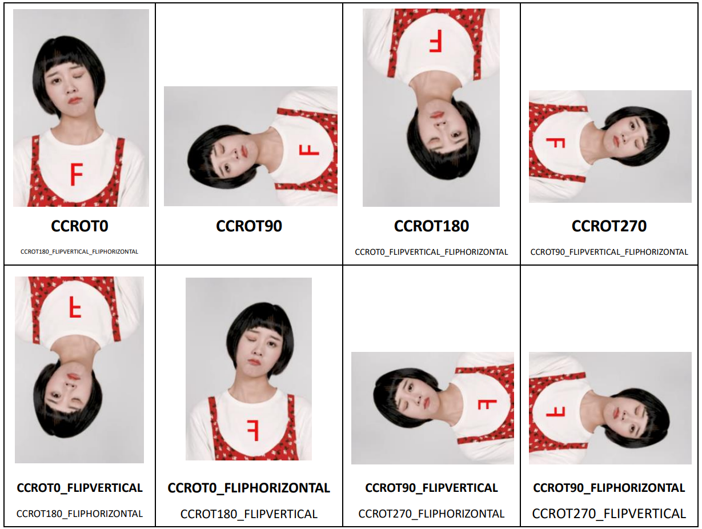
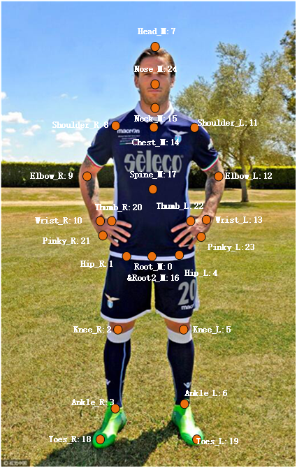

# Android Nama Java API Reference

Level：Public
Date：2021-04-19
SDK Version: 7.4.0

------
### Updates：

**2021-04-19 v7.4.0:**

 - Optimize 2D human body points and body beautification performance.
 - Optimize the effect and performance of human image segmentation. Optimize the unstable recognition of arms and hands and the misrecognition of background. Solve the problem of human image segmentation deviation.
 - Optimize the effect of makeup.Improve the fit of cosmetic lenses and solve the problem of color overflow. Optimize the cover effect of lipsticks. To be more specific, lipstick will no longer appear when the lip is covered.
 - Optimize the driving effect of Animoji on face. Optimize small movements. For example, the driving effect is more sensitive when opening mouth and blinking eyes in a small range.
 - Optimize emotion recognition and support 8 kinds of basic emotion recognition.
 - Added new API: fuSetUseAsyncAIInference. Support asynchronous mode. When it is turned on, the frame rate will be increased, which can improve insufficient frame rate on some low-end devices.
 - Added new interface: fuRender.Unified rendering interface for all services. See the API definition for more details.
 - Added API such as fuSetInputBufferMatrix，fuSetInputCameraBufferMatrixState，fuSetInputTextureMatrix，fuSetInputCameraTextureMatrixState，fuSetOutputMatrix，fuSetOutputMatrixState. They are used to set the image conversion matrix and adjust the output image direction. See the API definition for more details.


**2021-01-25 v7.3.2:**

1. Optimize the driving performance of facial expression tracking.

2. Change fuSetup function to thread safety.

3. fuSetUp 、fuCreateItemFromPackage、fuLoadAIModel function increase exception handling, and strengthen robustness.

4. Fix the the effect of the custom mirror's function.

5. Fix the crash problem of SDK on MAC 10.11.

6. Fix the crash problem of SDK when stickers and Animoji are in mixed use.  

**2020-12-29 v7.3.0:**

1. Optimize beauty performance. Compared with v7.2, the frame rate of standard beauty is increased by 29% and 17% in Android and IOS respectively.
2. Optimize the performance of body beautification. Compared with v7.2, the performance is improved significantly. The frame rate of Android is increased by 26%, and the CPU is reduced by 32%; the frame rate of IOS increased by 11%, CPU reduced by 46%, and memory reduced by 45%.
3. Optimize background segmentation performance. Compared with v7.2, the performance is significantly improved.The frame rate  of Android is increased by 64%, and the CPU is reduced by 25%; The frame rate of IOS is increased by 41%, CPU is reduced by 47%, and memory is reduced by 44%.
4. Optimize the effect of body beautification. When large amplitude motion occures, the problem of great deformation of objects near the head and shoulder is solved. When the human body appears and disappears in the picture, the transition is more natural.Body beautification effect of occlusion is more stable and no high frequency and continuous shaking left.
5. Optimize the expression recognition function. Improve the accuracy of recognition. A total of 17 kinds of expression can be recognized.
6. Optimize the green screen matting effect and improve the edge accuracy.
7. Optimize the driving effect of facial expression tracking, optimize the slow display of the first frame detection model, strengthen the subtle expression tracking, and optimize the problem that the model becomes smaller when the face rotates.
8. Optimize the whole body Avatar tracking driving effect. For continuous high-frequency and large amplitude motion, such as dancing, the overall model stability, especially the arm stability, is improved, and the shaking problem is significantly improved.
9. Optimize the problem of eyelid color overflow when eye brightness is used.
10. Added face drag deformation function. You can use FUCreator 2.1.0 to edit deformation effect.
11. Added thin round eyes in the beauty module. The effect is to make the whole eye enlarged, and the longitudinal amplification is extensively obvious.
12.Added support gesture to callback API fuSetHandGestureCallBack. See API document for details.
13. Added AI capability，expression recognition，AITYPE is FUAITYPE_FACEPROCESSOR_EXPRESSION_RECOGNIZER.

**2020-9-24 v7.2.0:**

1. Added green screen matting function, which supports to replace pictures, video background, etc. See green screen matting function documentation for details.
2. Added thin cheekbones and thin mandible in the beauty module.
3. Optimize beauty performance and power consumption. Solved the problem of frame dropping when integrating into the third-party streaming service.
4. Optimize the effect and performance of gesture recognition, improve the recognition stability and gesture following effect, optimize the CPU occupancy of gesture recognition.
5. Optimize the the performance of each function in PC, and the frame rate is significantly improved. The frame rate of hair beautification, body beautification and background segmentation is increased by more than 30%, and the frame rate of beauty, Animoji, makeup, gesture and other functions is also increased by more than 10%.
6. Optimization package is increased. SDK is divided into Lite version and full function version. The lite version is smaller and contains face related functions (except for face changing posters).
7. Optimize the stability of face tracking and stickers.
8. Independent core algorithm SDK is provided. See algorithm SDK document for API document.([FUAI_C_API_Reference.md](./FUAI_C_API_Reference.md))。
9. Added three parameters in fuGetFaceInfo API，including tongue direction(tongue_direction)，expression recognition(expression_type)，and head rotation information Euler angle parameter(rotation_euler)。
10. Added fuOnDeviceLostSafe function. See API document for details.
11. Added fuSetFaceProcessorDetectMode function. Face recognition tracking is devided into graphic mode and video mode. See API document for details.
12. Added human motion recognition movement definition documentation([Human_Motion_Recognition_Documentation.md](../resource/docs/Human_Motion_Recognition_Documentation.md))。
13. Added ai_hand_processor.bundle，replace ai_gesture.bundle，and provide gesture recognition tracking capability.

**2020-7-29 v7.1.0:**

1. Added face beautification sharpening function. See face beautification parameter documentation.
2. Optimize the skin grinding effect, and preserve more high-frequency details.
3. Added fuHumanProcessorGetFov API.
4. Added fuHumanProcessorSetFov API.

------

### Contents：

[TOC]

------

### 1. Introduction

This document is the infrastructure layer interface for FaceUnity face tracking and video effects development kit (Nama SDK for short). The Nama API in this document is the Native interface for direct development on PC/iOS/Android NDK/Linux. Development on the iOS and Android platforms can use the SDK's application-level interface (Objective-C/Java), which is closer to the platform-related development experience than the infrastructure layer interface in this article.

All SDK-related calls require sequential execution in the same thread, without support for multithreading. A small number of interfaces can be called asynchronously (such as props loading) and will be specifically noted in the remarks. Interfaces called by all main threads of the SDK need to keep the OpenGL context consistent, otherwise it will cause texture data exceptions. If you need to use the SDK's rendering function, all calls to the main thread need to pre-initialize the OpenGL environment, without initialization or incorrect initialization will cause a crash. Our environment requirement for OpenGL is GLES 2.0 or higher. For the specific call method, please refer to each platform demo.*

The infrastructure layer interface is classified into five categories according to the role of logic: initialization, propsloading, main running interface, destruction, functional interface, P2A related interface.

------

### 2. APIs
#### 2.1 Initialization

##### fuSetup

```java
@Deprecated
public static native int fuSetup(byte[] v3data, byte[] ardata, byte[] authdata);
public static native int fuSetup(byte[] v3data, byte[] authdata);
```

**Interface：**

Initialize the system environment, load system data, and perform network authentication. Must be executed before calling other interfaces of the SDK, otherwise it will cause a crash.

The first interface has been deprecated and the second one is recommended.

**Parameters：**

`v3data` v3.bundle: byte array. **Notes：** v3 will no longer use after SDK 6.6.0. Please pass  `new byte[0]` to use this parameter.

`ardata` Abandoned. Pass Null 

`authdata` Authentication data byte array

**Return Value：**

Returns a non-zero value for success and 0 for failure. If initialization fails, get the error code via ```fuGetSystemError```

**Notes: **

Once the app is launched, it only needs to be set once, where the authpack.A() authentication data is declared in authpack.java. A valid certificate must be configured for the SDK.

According to application requirements, authentication data can also be provided during runtime (such as network download), but it is necessary to pay attention to the risk of certificate leakage and prevent the abuse of certificates.

##### fuSetupLocal

Initialize the system environment, load system data, and perform network authentication. Must be executed before calling other interfaces of the SDK, otherwise it will cause a crash.

```java
public static native byte[] fuSetupLocal(byte[] v3data, byte[] authdata, byte[] offlinedata);
```

**API：**

Initialize the system environment, load system data, and perform network authentication. Must be executed before calling other interfaces of the SDK, otherwise it will cause a crash.

**Parameters：**

`v3data` v3.bundle: byte array. **Notes：** v3 will no longer use after SDK 6.6.0. Please pass  `new byte[0]` to use this parameter.

`authdata` Authentication data byte array.

`offlinedata` Offline authentication data byte array. Pass null for the first call. Pass the return value of the function for the subsequent calls.

**Return Value：**

Authentication date returned from cloud need to be saved to local for offline authentication. Use as parameter `offlinedata`.

**Notes：**

Once the app is launched, it only needs to be set once, where the authpack.A() authentication data is declared in authpack.java. A valid certificate must be configured for the SDK.

According to application requirements, authentication data can also be provided during runtime (such as network download), but it is necessary to pay attention to the risk of certificate leakage and prevent the abuse of certificates.

The first use requires online authentication. After successful authentication, the offline certificate will be returned. Please save the offline certificate data properly. The subsequent use is no need for networking.

If initialization fails, get the error code via ```fuGetSystemError```

----

##### fuIsLibraryInit

**Interface：**

Check whether the interface has been initialized.

```java
public static native int fuIsLibraryInit();
```

__Return Value:__  

0 stands for uninitialized and 1 stands for initialized.

-----

##### fuCreateTexForItem

**Interface：** Create texture for specific props, and set texture ID to props parameters for using props.

```java
public static native int fuCreateTexForItem(int item, String name, byte[] value, int width, int height);
```

__Parameter:__  
`item`：props handle
`name `：the name of prop parameter
`value`：image RGBA buffer
`width`：image width
`height`：image height
__Return Value:__  

0 stands for failure, and 1 for success
------

##### fuDeleteTexForItem

**Interface：**Release created texture by fuCreateTexForItem

```java
public static native int fuDeleteTexForItem(int item, String name);
```

__Parameter:__  
`item`：props handle
`name`：the name of prop parameter
__Return Value:__  

0 stands for failure, and 1 for success

------

##### fuSetDefaultRotationMode

**Interface：**Set the default face orientation.

```java
public static native void fuSetDefaultRotationMode(int rotationMode);
```

__Parameter:__  

`rotationMode`：The value range of face orientation to be set is 0-3,and the face is respectively rotated 0 degrees, 90 degrees, 180 degrees and 270 degrees relative to the image data.

__Notes:__  

The data of the original camera of Android is horizontal screen, which needs to be set to accelerate the first recognition. According to experience, Android's front camera generally sets parameter 1, and rear camera generally sets parameter 3. Some mobile phones may be the exceptions. The value is related to the device and camera direction. For the code of automatic calculation, please refer to FURenderer class in FULiveDemo.

The old API `fuSetDefaultOrientation` was abandoned. Please use `fuSetDefaultRotationMode` for setting.

--------

##### fuSetFaceProcessorDetectMode
**Interface：**SDK face recognition mode is divided into image mode and video mode. Image mode is more timely and video mode has better performance.  

```java
public static native int fuSetFaceProcessorDetectMode(int mode);
```
__Parameters：__  

`in]`：0 stands for image mode，and 1 for video mode. 

__Return Value：__  

0 stands for failure, and 1 for success.

------

##### fuSetInputCameraMatrix

**Interface：**Set the input texture conversion mode for the functions `fuRenderBundles`、`fuRenderBundlesWithCamera`、and `fuRenderBundlesSplitView`to use vertical screen mode.  

```java
public static native void fuSetInputCameraMatrix(int flip_x, int flip_y, int rotate_mode);
```

__Parameters:__  

`flip_x`：Flip horizontal input 
`flip_y`：Flip vertical input
`rotate_mode`：Rotate input. 0 is 0 degree, 1 is 90 degrees, 2 is 180 degrees, and 3 is 270 degrees.

-------

##### fuRotateImage
                                                                                                                                                                                                                                                                                                                                                                                                                                                                                                                                                                                                                                                                                                                                                                                                                                                                                                                                                                                              
Rotate or flip the image.  

```java
public static native int fuRotateImage(RotatedImage outImage, byte[] inputImage, int imageFormat, int inputWidth, int inputHeight, int rotateMode, int flipX, int flipY);
```

__Parameters:__  

`outImage`：Output image
`inputImage`：Input image
`imageformat`：The format of input image
`inputWidth`：The width of input image 
`inputHeight`：The height of input image
``rotateMode`：Rotate input. 0 is 0 degrees, 1 is 90 degrees, 2 is 180 degrees, 3 is 270 degrees. 
`flipX`：Flip horizontal input 
`flip_Y`：Flip vertical input

**Return Value：**

`int` 0 stands for failure, and 1 for success.

----

##### fuLoadAIModelFromPackage

**Interface：**

Newly added API in SDK6.6.0. After fuSetup，It can pre-load the AI capabilities that may need to be used in the future. AI model and SDK are launched together in Assets content. GL environment is not necessary for this function. Asynchronous call is useable.

```java
public static native int fuLoadAIModelFromPackage(byte[] data, int type);
```

__Parameters：__

`data`： Memory pointer，direct to ai****.bundle provided by SDK，which is AI capability model.

`type`：Describe the AI capability types corresponding to bundles as follows:

```c
typedef enum FUAITYPE{
	FUAITYPE_BACKGROUNDSEGMENTATION=1<<1,//Background segmentation, useable in V7.0.0 or above. FUAITYPE_HUMAN_PROCESSOR_SEGMENTATION
	FUAITYPE_HAIRSEGMENTATION=1<<2,		//Hair segmentation，useable in V7.0.0 or above. FUAITYPE_FACEPROCESSOR_HAIRSEGMENTATION
	FUAITYPE_HANDGESTURE=1<<3,			//Gesture recognition
	FUAITYPE_TONGUETRACKING=1<<4,		//Not used yet
	FUAITYPE_FACELANDMARKS75=1<<5,		//Abandoned
	FUAITYPE_FACELANDMARKS209=1<<6,		//Abandoned
	FUAITYPE_FACELANDMARKS239=1<<7,		//Advanced facial feature points. The actual points after V7.0.0 is 241.
	FUAITYPE_HUMANPOSE2D=1<<8,			//2D body points，useable in V7.0.0 or above. FUAITYPE_HUMAN_PROCESSOR_2D_DANCE
	FUAITYPE_BACKGROUNDSEGMENTATION_GREEN=1<<9,//Green screen segmentation
	FUAITYPE_FACEPROCESSOR=1<<10，				//Face algorithm module, with low quality and high performance expression tracking by default.
	FUAITYPE_FACEPROCESSOR_FACECAPTURE = 1 << 11,	//high quality expression tracking
  	FUAITYPE_FACEPROCESSOR_FACECAPTURE_TONGUETRACKING = 1 << 12,	//Extra tongue tracking in high quality expression tracking mode
  	FUAITYPE_FACEPROCESSOR_HAIRSEGMENTATION = 1 << 13,	//Hair segmentation in face algorithm mode
  	FUAITYPE_FACEPROCESSOR_HEADSEGMENTATION = 1 << 14,	//Head segmentation in face algorithm mode
  	FUAITYPE_FACEPROCESSOR_EXPRESSION_RECOGNIZER = 1 << 15, //expression recognition
  	FUAITYPE_HUMAN_PROCESSOR = 1 << 16,			//Human body algorithm module
  	FUAITYPE_HUMAN_PROCESSOR_DETECT = 1 << 17,	//In the human body algorithm mode, the whole human body detection is carried out in every frame, and the performance is relatively poor
  	FUAITYPE_HUMAN_PROCESSOR_2D_SELFIE = 1 << 18,//2D half body point positioning in human body algorithm mode
  	FUAITYPE_HUMAN_PROCESSOR_2D_DANCE = 1 << 19,//2D whole body point positioning in human body algorithm mode
  	FUAITYPE_HUMAN_PROCESSOR_2D_SLIM = 1 << 20,//Body algorithm mode for 2D whole body points, optimize the whole body key point detection mode for the body scene, with faster performance
  	FUAITYPE_HUMAN_PROCESSOR_3D_SELFIE = 1 << 21,//3D half body point positioning in human body algorithm mode
  	FUAITYPE_HUMAN_PROCESSOR_3D_DANCE = 1 << 22,//3D whole body point positioning in human body algorithm mode
  	FUAITYPE_HUMAN_PROCESSOR_SEGMENTATION = 1 << 23 //Human segmentation in human algorithm mode
}FUAITYPE;
```

__Return Value：__

`int` 0 stands for failure, and 1 for success.


Model can be released via fuReleaseAIModel. fuIsAIModelLoaded can check whether Ai capability model is loaded.

__Notes:__  

AI capability will launch with SDK，saved in assets/model.
- ai_bgseg.bundle is the AI ability model of background segmentation, corresponding to FUAITYPE_BACKGROUNDSEGMENTATION. After V7.0.0, the whole body mask module corresponding to ai_human_processor.bundle can be used uniformly.
- ai_hairseg.bundle is hair segmentation AI capability model, corresponding to FUAITYPE_HAIRSEGMENTATION。After V7.0.0，the whole body mask module corresponding to ai_face_processor.bundle can be used uniformly.
- ai_hand_processor.bundle ( ai_gesture.bundle will be abandoned after V7.2.0 ） is gesture recognition AI capability model, corresponding to FUAITYPE_HANDGESTURE. 
- ai_facelandmarks75.bundle is a 75 point AI capability model for facial feature points.	//Abandoned
- ai_facelandmarks209.bundle is a 209 point AI capability model for facial feature points.	//Abandoned
- ai_facelandmarks239.bundle is a 239 point AI capability model for facial feature points.	//Abandoned
- ai_humanpose.bundle is the human 2D point AI capability model, corresponding to FUAITYPE_HUMANPOSE2D。After V7.0.0，the human body points module corresponding toai_human_processor.bundle can be used uniformly.
- ai_bgseg_green.bundle is green screen background segmentation AI capability model, corresponding to FUAITYPE_BACKGROUNDSEGMENTATION_GREEN.
- ai_face_processor.bundle is facial feature points, expression tracking, hair mask, head mask, expression recognition and other AI capability models. It needs to be loaded by default, corresponding to FUAITYPE_FACEPROCESSOR.
- ai_human_processor.bundle  is a human algorithm capability model, including human detection, 2D Human key points (whole body, half body), 3D human skeleton (whole body, half body), human image mask, action recognition and other capabilities，corresponding to FUAITYPE_HUMAN_PROCESSOR.__Notes:__ ai_human_processor_mb_fast.bundle is a high performance version of mobile phone background segmentation.

##### fuReleaseAIModel

**Interface：**

When there is no need to use specific AI capabilities, it can release its resources and save memory space.

```java
public static native int fuReleaseAIModel(int type);
```

__Parameters：__

`type`：Describe the AI capability types corresponding to bundles. See above for details.
`fuLoadAIModelFromPackage ` Parameters description

__Return Value：__

`int` 1 stands for released, and 0 for not released yet.

__Notes: __  

The memory consumption of AI capability model is not high, so it is recommended to stay in memory for a long time.

------

##### fuIsAIModelLoaded

**Interface：**

Get to know whether the AI capability has been loaded.

```java
public static native int fuIsAIModelLoaded(int type);
```

__Parameters：__

`type`：Describe the AI capability types corresponding to bundles. See above for details.
`fuLoadAIModelFromPackage ` Parameters description

__Return Value：__

`int` 0 stands for not loaded yet, and 1 for loaded.

__Notes:__  

The memory consumption of AI capability model is not high, so it is recommended to stay in memory for a long time.

--------

##### fuGetLogLevel

**Interface：**

Get the current log level.

```java
public static native int fuGetLogLevel();
```

__Return Value：__

FULOGLEVEL，the definition is as follow：

```C
typedef enum FULOGLEVEL {
  FU_LOG_LEVEL_TRACE = 0, //Debug log, multiple times per frame
  FU_LOG_LEVEL_DEBUG = 1, //Debug log, one or more messages per frame
  FU_LOG_LEVEL_INFO = 2,  //Normal information log, information appearing once in the process of program running, system information, etc
  FU_LOG_LEVEL_WARN = 3,  //Warning log
  FU_LOG_LEVEL_ERROR = 4, //Error log
  FU_LOG_LEVEL_CRITICAL = 5, //Error log and log that affect the normal operation of the program
  FU_LOG_LEVEL_OFF = 6 //Turn off log output
} FULOGLEVEL;
```

------

##### fuSetLogLevel

**Interface：**

Set the current log level and the default is INFO level. Set when FU_LOG_LEVEL_OFF, close all logs. Set only when the log greater than or equal to the current level, the log can be output normally.

```java
public static native int fuSetLogLevel(int level);
```

__Parameters：__

`level`：Set the current log level. See FULOGLEVEL definition for details.

__Return Value：__

1 stands for success，and 0 for failure.

------

##### fuOpenFileLog

**Interface：**

Open file log, nullptr use console log by default.

```java
public static native int fuOpenFileLog(String file_pullname, int max_file_size, int max_files);
```

__Parameters：__

`file_pullname`：Log file name, full path, log file location are determined by external. nullptr represents using console log by default.
`max_file_size`：Log file maximum size, exceeding will be reset.
`max_files`：Rotate the number of log files and rotate among multiple log files.

__Return Value：__

1 stands for success，and 0 for failure.

-----

##### fuHexagonInitWithPath

**Interface：**

Initialization of Hexagon dsp acceleration function can reduce the calculation time of some algorithms and improve the performance.

Algorithm that supports dsp acceleration includes human body detection algorithm and human skeleton key point algorithm.

The following four dynamic libraries need to be loaded dynamically in order to support the operation of dsp: libhexagon_interface.so,libHexagon_nn_skel.so,libHexagon_nn_skel_v65.so,libHexagon_nn_skel_v66.so. This interface needs to pass in the paths of the four dynamic libraries during initialization

```java
public static native void fuHexagonInitWithPath(String var0);
```

__Parameters：__

`var0`：The path of dsp dependent dynamic library

__Notes:__  
Only when integrated relatively new Qualcomm CPU, can Android support dsp acceleration. Up until now, the CPU includes Snapdragon 835, Snapdragon 660/820/821、Snapdragon 710/845、Snapdragon 855、Snapdragon 865.

At present, dsp acceleration is still in the internal trial stage. There may be compatibility problems, so it is not recommended for customers to use large-scale integration.

----

##### LoadConfig.loadLibrary

**Interface：**

It is used to load external dynamic libraries. If you want to use this function, make sure to call before using faceunity static method and static internal class, usually before fuSetup.

```java
public static void loadLibrary(String soDir);
```

**Parameters：**

`soDir`: so file path，for example /data/data/com.faceunity.fulivedemo/app_libs/arm64-v8a/. This path need contain two libraries: libCNamaSDK.so and libfuai.so. It is suggested that the so file should be placed in the private directory of the application, so as to avoid the risk of external exposure.

**Notes: **

On some Android 5.0 devices that support 64 bit dynamic library, there will be an exception when loading 64 bit so dynamically, which is caused by the underlying bug of the system. It is recommended to use 32-bit library.

-----

#### 2.2 Prop package loading

##### fuCreateItemFromPackage

```java
public static native int fuCreateItemFromPackage(byte[] data);
```

**Interface：**

Load the prop package so that it can be executed in the main run interface. A prop package may be a function module or a collection of multiple function modules. The prop loading package may activate the corresponding function module and implement plug and play in the same SDK calling logic.

**Parameters：**

`data ` Prop binary

**Return Value：**

`int ` Created prop handle

**Notes：**

The interface can be executed asynchronously with rendering without GL environment. In order to avoid loading props to block the rendering thread, it is recommended to call asynchronously.

---

##### fuItemSetParam

```java
public static native int fuItemSetParam(int item, String name, double value);
public static native int fuItemSetParam(int item, String name, double[] value);
public static native int fuItemSetParam(int item, String name, String value);
```

**Interface：**

Modify or set the value of the variable in the prop package. support the prop package variable name, meaning, and range of values (please refer to the prop document).

**Parameters：**

`item ` prop handle

`name ` parameter name

`value ` parameter value，only supports double, double[], String

**Return Value：**

`int ` : returns 0 means failure, greater than 0 means success.

---

##### fuItemGetParam

```java
public static native double fuItemGetParam(int item,String name);
```

**Interface：**

Get the value of the variable in the prop item. support the prop package variable name, meaning, and range of values (please refer to the prop document)

**Parameters：**

`item ` ：prop handle

`name ` : parameter name 

**Return Value：**

`double ` :parameter value

**Notes：**

This interface can be executed asynchronously with rendering thread.

---

##### fuItemGetParamString

```java
public static native String fuItemGetParamString(int item,String name);
```

**Interface：**

Get the string type variable in the prop. Support the prop package variable name, meaning, and range of values. (Please refer to the prop document)

**Parameters：**

`item ` ：prop handle

`name ` : parameter name 

**Return Value：**

`String ` ：parameter value

**Notes：**

This interface can be executed asynchronously with the rendering thread.

---

#### 2.3 Main running interface

##### fuDualInputToTexture

```java
public static native int fuDualInputToTexture(byte[] img, int tex_in, int flags, int w, int h, int frame_id, int[] h);
```

**Interface：**

The input image data is sent to the SDK pipeline for processing, and output the processed image data. The interface will execute all the props required, and the certificate of the licensed function module, including face detection and tracking, beauty, stickers or avatar rendering.

**Parameters：**

`img ` ：the image data byte[]，support ：NV21（default）、I420、RGBA

`tex_in `: image data texture id

`flags ` flags: specify the data img data format, return the prop mirror of the texture ID, etc. See "Android dual input" for details.

`w ` : The width of the input image

`h ` : The height of the input image

`frame_id ` : The current processed frame sequence number

`items ` : Int array containing multiple prop handles

**Return Value：**

`int ` : The texture ID of the output image after processing. if the return value is less than or equal to 0, you can get the specific information via fuGetSystemError. Date returned by texture is 2D.

**Notes: **

The rendering interface requires an OpenGL environment, or an exception in the environment can cause a crash.

Image data after beauty processing will not be written back to img by default. When parameter flags is set to `FU_ADM_FLAG_ENABLE_READBACK`, it will be written back to img with the same width and height. If you need to customize the output data, call the `fuDualInputToTexture` interface with the readback parameter.

This input mode reduces CPU-to-GPU data transfer and significantly optimizes performance on the Android platform, so it is recommended to use this interface as far as possible.

---

##### fuRenderDualInput

```java
public static native int fuRenderDualInput(int w, int h, int frame_id, int[] items, int tex_in, int flags, byte[] img, int imgType, int readback_w, int readback_h, byte[] readback_img);
```

**Interface：**

The input image data is sent to the SDK pipeline for processing, and output the processed image data. The interface will execute all the props required, and the certificate of the licensed function module, including face detection and tracking, beauty, stickers or avatar rendering.

**Parameters：**

`w ` :The width of the input image

`h ` :The height of the input image

`frame_id ` :The current processed frame sequence number

`items ` : Int array containing multiple prop handles

`tex_in ` : image data texture id

`flags ` flags: specify the data img data format, return the prop mirror of the texture ID, etc. See "Android dual input" for details.

`img ` ：the image data byte[]，support ：NV21（default）、I420、RGBA

`imgType ` : image type，faceunity.FU_FORMAT_NV21_BUFFER  faceunity.FU_FORMAT_RGBA_BUFFER faceunity.FU_FORMAT_I420_BUFFER   YUV：0

`readback_w ` : the width of the image data that needs to be written back

`readback_h ` ：the height of the image data that needs to be written back

`readback_img ` : the image data byte[] to be written back 

**Return Value：**

`int `: The texture ID of the output image after processing. if the return value is less than or equal to 0, you can get the specific information via `fuGetSystemError`. The data returned by texture is 2D.

**Notes: **

The rendering interface requires an OpenGL environment, otherwise it will lead to crash.

Image data after beauty processing will not be written back to img by default. When parameter flags is set to `FU_ADM_FLAG_ENABLE_READBACK`, it will be written back to img with the same width and height.

---

##### fuRenderTexture

```java
 public static native int fuRenderTexture(int w, int h, int frame_id, int[] items, int tex_in, int flags);
```

**Interface：**

The input image data is sent to the SDK pipeline for processing, and output the processed image data. The interface will execute all the props required, and the certificate of the licensed function module, including face detection and tracking, beauty, stickers or avatar rendering.

**Parameters：**

`w ` : the width of image data

`h ` : the height of image data

`frame_id ` : The current processed frame sequence number

`items ` : Int array containing multiple prop handles

`tex_in ` : Image texture ID

`flags ` flags: specify the data img data format, return the prop mirror of the texture ID, etc. See "Android dual input" for details.

**Return Value：**

`int ` : The texture ID of the output image after processing. if the return value is less than or equal to 0, you can get the specific information via `fuGetSystemError`. The data returned by texture is 2D.

**Notes: **

The rendering interface requires an OpenGL environment, otherwise it will lead to crash.

If you need to customize the output data, call the `fuRenderToTexture` with the readback parameter.

-------

##### fuRenderImg

```java
public static native int fuRenderImg(int w, int h, int frame_id, int[] items, int flags, byte[] img, int imgType, int readback_w, int readback_h, byte[] readback_img);

```

**Interface：**

The input image data is sent to the SDK pipeline for processing, and output the processed image data. The interface will execute all the props required, and the certificate of the licensed function module, including face detection and tracking, beauty, stickers or avatar rendering.

**Parameters：**

`w ` : the width of image data

`h ` : the height of image data

`frame_id ` :The current processed frame sequence number

`items ` : Int array containing multiple prop handles

`flags ` flags: specify the data img data format, return the prop mirror of the texture ID, etc. See "Android dual input" for details.

`img `: Image data byte[], the processed image data will be written back to the byte[]

`imgType ` : Image type，faceunity.FU_FORMAT_NV21_BUFFER  faceunity.FU_FORMAT_RGBA_BUFFER faceunity.FU_FORMAT_I420_BUFFER   YUV：0

`readback_w `  :  the width of the image data that needs to be written back

`readback_h `  ：the height of the image data that needs to be written back

`readback_img ` : the image data byte[] to be written back 

**Return Value：**

`int `: The texture ID of the output image after processing. if the return value is less than or equal to 0, you can get the specific information via `fuGetSystemError`. The data returned by texture is 2D.

**Notes: **

The rendering interface requires an OpenGL environment, otherwise it will lead to crash.

If you need to customize the output data, call the  `fuRenderToNV21Image` with the readback parameter.

---

 

##### fuRenderYUV

```java
 public static native int fuRenderYUV(int w, int h, int frame_id, int[] items, int flags, byte[] y_buffer, byte[] u_buffer, byte[] v_buffer, int y_stride, int u_stride, int v_stride, boolean read_back);

```

**Interface：**

The input image data is sent to the SDK pipeline for processing, and output the processed image data. The interface will execute all the props required, and the certificate of the licensed function module, including face detection and tracking, beauty, stickers or avatar rendering.

Draw the props in items into the YUV three channel image.

**Parameters：**

`w `:The width of the input image

`h ` :The height of the input image

`frame_id ` : The currently processed video frame number, which is incremented by 1 each time it is processed. Without adding 1 it will not be able to drive the effect animation in the item.

`items ` Int array containing multiple prop handles, such as general props, face beautification props, gesture props, etc.

`flags ` flags: return the prop mirror of the texture ID, etc.

`y_buffer ` :Y frame image data byte[]

`u_buffer ` :U frame image data byte[]

`v_buffer ` :V frame image data byte[]

`y_stride ` :Y frame stride

`u_stride ` :U frame stride

`v_stride ` :V frame stride

`read_back ` : whether need to be re-written


**Return Value：**

`int ` : The texture ID of the output image after processing. if the return value is less than or equal to 0, you can get the specific information via `fuGetSystemError`. The data returned by texture is 2D.

**Notes：**

The rendering interface requires an OpenGL environment, otherwise it will lead to crash.

---

##### fuBeautifyImage

```java
public static native int fuBeautifyImage(int tex_in, int flags, int w, int h, int frame_id, int[] items);
```

**Interface：**

The input image data is sent to the SDK pipeline for the whole picture to beautified, and the processed image data is output. This interface only performs image-level beautification (including filters, skins), and does not perform face tracking and all face-related operations (such as beauty). Due to the centralized functionality, compared with```fuRenderItemsEx```, this interface requires less computation and is more efficient to execute.

**Parameters：**

`tex_in `  : Texture ID for image data

`flags ` flags: Specify the data img data format, return the prop mirror of the texture ID, etc. See "Android dual input" for details.

`w ` : the width of image data

`h ` : the height of image data

`frame_id ` : The currently processed video frame number, which is incremented by 1 each time it is processed. Without adding 1 it will not be able to drive the effect animation in the item.

`items ` : An int array containing multiple prop handles, including common props, beauty props, gesture props, etc.

**Return Value：**

`int ` : The texture ID of the output image after processing. if the return value is less than or equal to 0, you can get the specific information via `fuGetSystemError`. The data returned by texture is 2D.

**Notes：**

This interface will only take effect if you pass the beauty item (as the SDK is distributed, the file name is usually face_beautification.bundle).

The rendering interface requires an OpenGL environment, otherwise it will lead to crash.

--------

##### fuRenderBundles

The input image data is sent to the SDK pipeline for processing, and output the processed image data. The interface will execute Controller, FXAA, CartoonFilter and other props' requirements and the certificate of the licensed function module, including face detection and tracking, beauty, stickers or avatar rendering.

```java
public static native int fuRenderBundles(AvatarInfo avatar_info, int flags, int w, int h, int frame_id, int[] items);
```

__Parameters：__  

`avatar_info` Avatar model information. Pass in an example of the default construct。

`flags ` : Specify the data img data format, return the prop mirror of the texture ID, etc. See "Android dual input" for details.

`w ` : the width of image data

`h ` : the height of image data

`frame_id`：The current processed frame sequence number, which is used to control the animation logic in props.

`items `: Int array containing multiple prop handles，in which every identifier should be the return value of  ```fuCreateItemFromPackage``` function，and the content of the props were not destroyed.

__Return Value：__  

The texture ID of the output image after processing.

__Notes:__  

Even in the non-texture mode, the function still returns the texture ID of the output image. Although the output image may be in a variety of optional formats, the rendering is always finished by GPU, so the texture ID of the output image always exists. The output OpenGL texture is created in the current OpenGL context by SDK runtime, and its ID should be different from the input ID. When using the texture after output, you need to ensure that the OpenGL context is consistent.  

The rendering interface requires an OpenGL environment, otherwise it will lead to crash.

-------

##### fuRenderBundlesWithCamera

The input image data is sent to the SDK pipeline for processing, and output the processed image data. The interface will execute Controller, FXAA, CartoonFilter and other props' requirements and the certificate of the licensed function module, including face detection and tracking, beauty, stickers, avatar rendering, FXAA anti-aliasing, post-processing of cartoon filter, etc.

```java
public static native int fuRenderBundlesWithCamera(byte[] img, int tex_in, int flags, int w, int h, int frame_id, int[] items);
```

__Parameters：__  

`img ` : Image data byte[]. Supported formats：NV21（defaut）、I420、RGBA

`tex_in `: Input image texture ID

`flags ` : Return the prop mirror of the texture ID, etc. See "Android dual input" for details.

`w ` : The width of image data

`h ` : The height of image data

`frame_id`：The current processed frame sequence number, which is used to control the animation logic in props.

`items ` : Int array containing multiple prop handles，in which every identifier should be the return value of  ```fuCreateItemFromPackage``` function，and the content of the props were not destroyed.

__Return Value:__  

The texture ID of the output image after processing.

__Notes:__  

Even in the non-texture mode, the function still returns the texture ID of the output image. Although the output image may be in a variety of optional formats, the rendering is always finished by GPU, so the texture ID of the output image always exists. The output OpenGL texture is created in the current OpenGL context by SDK runtime, and its ID should be different from the input ID. When using the texture after output, you need to ensure that the OpenGL context is consistent.  

The rendering interface requires an OpenGL environment, otherwise it will lead to crash.

------

##### fuRenderBundlesSplitView

The input image data is sent to the SDK pipeline for processing, and output the processed image data. The interface will execute Controller, FXAA, CartoonFilter and other props' requirements and the certificate of the licensed function module, including face detection and tracking, beauty, stickers, avatar rendering, FXAA anti-aliasing, post-processing of cartoon filter, etc.

Compared with ```fuRenderBundlesEx```, the interface uses split screen rendering, and the input image and the virtual Avatar will be drawn in two viewports.

```java
public static native int fuRenderBundlesSplitView(AvatarInfo avatar_info, int flags, int w, int h, int frame_id, int[] items, SplitViewInfo split_view_info);
```

__Parameters：__  

`avatar_info` Avatar model information. Pass in an example of the default construct

`flags ` : Return the prop mirror of the texture ID, etc. See "Android dual input" for details.

`w ` : The width of image data

`h ` : The height of image data

`frame_id`：The current processed frame sequence number, which is used to control the animation logic in props.

`items ` : Int array containing multiple prop handles，in which every identifier should be the return value of  ```fuCreateItemFromPackage``` function，and the content of the props were not destroyed.

`split_view_info`：Split screen interface parameters, detailed format list in the subsequent chapters [Input Output Format List](#Input_Output_Format_List).

__Return Value：__  

The texture ID of the output image after processing.

__Notes:__  

Even in the non-texture mode, the function still returns the texture ID of the output image. Although the output image may be in a variety of optional formats, the rendering is always finished by GPU, so the texture ID of the output image always exists. The output OpenGL texture is created in the current OpenGL context by SDK runtime, and its ID should be different from the input ID. When using the texture after output, you need to ensure that the OpenGL context is consistent.  

The rendering interface requires an OpenGL environment, otherwise it will lead to crash.

---

##### fuAvatarToTexture 

```java
public static native int fuAvatarToTexture(float[] pupilPos, float[] expression, float[] rotation, float[] rmode, int flags, int w, int h, int frame_id, int[] items, int isTracking);
```

**Interface：**

The picture is rendering based on the face information obtained by the fuTrackFace.

**Parameters：**

`pupilPos ` :eye direction, length is 2

`expression `:  expression coefficient, length is 46

`rotation ` : the return value is the rotation quaternion, and the length is 4

`rmode ` : face orientation, 0-3 corresponds to the four orientations of the mobile phone, length 1

`flags `  flags: specify the data img data format, return the prop mirror of the texture ID, etc.

`w ` : the width of image 

`h ` : the height of image 

`frame_id ` : the currently processed video frame number, which is incremented by 1 each time it is processed. Without adding 1 it will not be able to drive the effect animation in the item.

`items ` : an int array containing multiple prop handles, including common props, beauty props, gesture props, etc.

`isTracking ` : whether the face is recognized or not, the value obtained by the fuIsTracking method can be directly passed.

**Return Value：**

`int ` : The texture ID of the output image after processing. if the return value is less than or equal to 0, you can get the specific information via `fuGetSystemError`. The data returned from texture is 2D.

**Notes: **

The rendering interface requires an OpenGL environment, otherwise it will lead to crash.

----

##### fuTrackFace

```java
public static native void fuTrackFace(byte[] img, int format, int w, int h);
```

**Interface：**

Only the face tracking operation is performed on the input image data, and all other image and rendering related operations are not executed, so the function has no image output. Since this function does not perform rendering-related operations and only contains CPU calculations, it can operate without an OpenGL environment. After the function executes the face tracking operation, the resulting face information is acquired through the```fuGetFaceInfo```.

**Parameters：**

`img ` : image data byte[]

`flags ` format：`FU_FORMAT_RGBA_BUFFER` 、 `FU_FORMAT_NV21_BUFFER` 、 `FU_FORMAT_NV12_BUFFER` 、 `FU_FORMAT_I420_BUFFER`

`w ` : the width of image data

`h ` : the height of image data

**Return Value：**

`int ` : the number of faces detected, returning 0 means no face detected.

**Notes: **

This interface does not require OpenGL environment and can be called outside of the rendering thread.

----

##### fuTrackFaceWithTongue

```java
public static native void fuTrackFaceWithTongue(byte[] img, int format, int w, int h);
```

**Interface：**

Same as ``` fuTrackFace ```，tracking the tongue's blendshape coefficient while tracking facial expressions.  
Only the face tracking operation is performed on the input image data, and all other image and rendering related operations are not executed, so the function has no image output. Since this function does not perform rendering-related operations and only contains CPU calculations, it can operate without an OpenGL environment. After the function executes the face tracking operation, the resulting face information is acquired through the```fuGetFaceInfo```. 

**Parameters：**

`img ` : image data byte[]

`flags ` format：`FU_FORMAT_RGBA_BUFFER` 、 `FU_FORMAT_NV21_BUFFER` 、 `FU_FORMAT_NV12_BUFFER` 、 `FU_FORMAT_I420_BUFFER`

`w ` : the width of image data

`h ` : the height of image data

**Return Value：**

`int ` : the number of faces detected, returning 0 means no face detected.

**Notes：**

Need to call `fuLoadTongueModel` to load tongue.bundle，then tongue tracking will be available.

This interface does not require OpenGL environment and can be called outside of the rendering thread.

---

#### 2.4 Destroy

##### fuDestroyItem

```java
public static native void fuDestroyItem(int item);
```

**Interface：**

Destroy the props by the props handle and release the related resources. After destroying the props, set the prop handle to 0 to avoid the SDK from using invalid handles and causing program errors.

**Parameters：**

`item `: prop handle

__Notes:__  

After the function is called, the prop identifier will be released immediately. The memory occupied by the prop cannot be released instantaneously. It needs to be recycled by the GC mechanism when the SDK executes the main processing interface.

---

##### fuDestroyAllItems

```java
public static native void fuDestroyAllItems();
```

**Interface：**

Destroy the props by the props handle and release the related resources. After destroying the props, set the prop handle to 0 to avoid the SDK from using invalid handles and causing program errors.

__Notes:__  

This function will immediately release the system's resources. However, ```fuSetup```'s system initialization information will not be destroyed. When the application is temporarily suspended to the background, the function can be called to release resources, and it is not necessary to reinitialize the system when it is activated again. 

----

##### fuOnDeviceLost

**Interface：**

A special function. When the program exits or OpenGL context is ready to be destroyed, this function will be called to clean up and recycle resources, and all memory resources occupied by the system will be released, including GPU resources and memory of GL.

```java
public static native void fuOnDeviceLost();
```

__Notes:__  

The function must be called with context, and the context must be consistent with the context of the series rendering functions at the beginning of fuRender, otherwise, the memory related to OpenGL resources may leak due to context changes.

-------

##### fuOnDeviceLostSafe
**Special function**，When there is a logical bug in the client calling code, it may cause the OpenGL context state to be abnormal. At this time, fuondevicelost can not successfully release the GPU resources, which will lead to the application crash. If the client bug cannot be effectively located, this function can be used instead. This function is only responsible for the release of CPU resources, GPU resources do not destroy the operation, through the destruction of external context unified maintenance.

```java
public static native void fuOnDeviceLostSafe();
```

__Notes:__  

1. Please use fuOndeviceLost function first. Only when OpenGL environment proves to be abnormal can you use this function.

2. Improper calls will cause memory leakage related to OpenGL resources. Improper calls include: repeatedly calling this function in the same OpenGL context.

----

##### fuDestroyLibData
**Interface：**

Special function. When Nama SDK is no longer needed, you can release related resources allocated by fusetup. After initialization. is called，Face tracking, prop drawing, fuRender related API, ```fuTrackFace``` and other functions will be disabled. f you need to use it, you need to call ```fuSetup```again for initialization.

```java
public static native void fuDestroyLibData();
```

##### fuHexagonTearDown
**Interface：**

Turn off dsp acceleration and release resources.

```java
public static native void fuHexagonTearDown();
```

---

#### 2.5 Functional interface - System

##### TRANSFORM_MATRIX
An image has at most eight directions, TRANSFORM_MATRIX defines the transformation of an image. The order of transformation is to rotate counterclockwise first, and then mirror.
```C
typedef enum TRANSFORM_MATRIX {
  /*
   * 8 base orientation cases, first do counter-clockwise rotation in degree,
   * then do flip
   */
  DEFAULT = 0,             // no rotation, no flip
  CCROT0 = DEFAULT,        // no rotation, no flip
  CCROT90,                 // counter-clockwise rotate 90 degree
  CCROT180,                // counter-clockwise rotate 180 degree
  CCROT270,                // counter-clockwise rotate 270 degree
  CCROT0_FLIPVERTICAL,     // vertical flip
  CCROT0_FLIPHORIZONTAL,   // horizontal flip
  CCROT90_FLIPVERTICAL,    // first counter-clockwise rotate 90 degree，then
                           // vertical flip
  CCROT90_FLIPHORIZONTAL,  // first counter-clockwise rotate 90 degree，then
                           // horizontal flip
  /*
   * enums below is alias to above enums, there are only 8 orientation cases
   */
  CCROT0_FLIPVERTICAL_FLIPHORIZONTAL = CCROT180,
  CCROT90_FLIPVERTICAL_FLIPHORIZONTAL = CCROT270,
  CCROT180_FLIPVERTICAL = CCROT0_FLIPHORIZONTAL,
  CCROT180_FLIPHORIZONTAL = CCROT0_FLIPVERTICAL,
  CCROT180_FLIPVERTICAL_FLIPHORIZONTAL = DEFAULT,
  CCROT270_FLIPVERTICAL = CCROT90_FLIPHORIZONTAL,
  CCROT270_FLIPHORIZONTAL = CCROT90_FLIPVERTICAL,
  CCROT270_FLIPVERTICAL_FLIPHORIZONTAL = CCROT90,
} TRANSFORM_MATRIX;
```
DEFAULT or CCROT0 default input direction is not processed. CCROT90 is 90 degrees counter clockwise. CCROT90_FLIPVERTICAL is 90 degrees counterclockwise before flipping vertically. As shown in the figure below,



------

##### fuSetInputTextureMatrix

Set input source texture orientation

```java
/**
 \brief input description for fuRender api, use to transform the input gpu
 texture to portrait mode(head-up). then the final output will portrait mode.
 the outter user present render pass should use identity matrix to present the
 result.
 \param tex_trans_mat, the transform matrix use to transform the input
 texture to portrait mode.
 \note when your input is cpu buffer only don't use
 this api, fuSetInputCameraBufferMatrix will handle all case.
 */
public static native void fuSetInputTextureMatrix(int tMat);
```
__Parameters:__  
`tMat`：Rotation category，see TRANSFORM_MATRIX definition for details.
CCROT0：0
CCROT90：1
CCROT180：2
CCROT270：3
CCROT0_FLIPVERTICAL：4
CCROT0_FLIPHORIZONTAL：5
CCROT90_FLIPVERTICAL：6
CCROT90_FLIPHORIZONTAL：7

##### fuSetInputCameraTextureMatrixState

```java
public static native void fuSetInputCameraTextureMatrixState(int enable);
```

**Interface：**

Sets whether the TransformMatrix set by `fuSetInputTextureMatrix` takes effect.

**Parameters：**

`enable`: 1 means on ，0 means off

------

##### fuSetInputBufferMatrix

```java
/**
 \brief input description for fuRender api, use to transform the input cpu
 buffer to portrait mode(head-up). then the final output will portrait mode. the
 outter user present render pass should use identity matrix to present the
 result.
 \param buf_trans_mat, the transform matrix use to transform the input
 cpu buffer to portrait mode.
 \note when your input is gpu texture only don't
 use this api, fuSetInputCameraTextureMatrix will handle all case.
 */
public static native void fuSetInputBufferMatrix(int tMat);
```
**Interface：**

Set input source Buffer orientation

**Parameters：**

`tMat`：Rotation category，see TRANSFORM_MATRIX definition for details.
CCROT0：0
CCROT90：1
CCROT180：2
CCROT270：3
CCROT0_FLIPVERTICAL：4
CCROT0_FLIPHORIZONTAL：5
CCROT90_FLIPVERTICAL：6
CCROT90_FLIPHORIZONTAL：7

##### fuSetInputCameraBufferMatrixState

```java
public static native void fuSetInputCameraTextureMatrixState(int enable);
```

**Interface：**
Sets whether the TransformMatrix set by `fuSetInputTextureMatrix` takes effect.

**Parameters：**

`enable`: 1 means on ，0 means off

------

##### fuSetOutputMatrix

```java
/**
 \brief add optional transform for final result, when use
 fuSetInputCameraTextureMatrix/fuSetInputCameraBufferMatrix, we means the output
 is in portrait mode(head-up), and the outter user present render pass should
 use identity matrix to present the result. but in some rare case, user would
 like to use a diffent orientation output. in this case,use
 fuSetInputCameraTextureMatrix/fuSetInputCameraBufferMatrix(portrait mode), then
 use the additional fuSetOutputMatrix to transform the final result to perfer
 orientation.
 \note Don't use this api unless you have to!
 */
public static native void fuSetOutputMatrix(int bMat);
```
**Interface：**

Modify the orientation of output data

**Parameters：**

`tMat`：Rotation category，see TRANSFORM_MATRIX definition for details.
CCROT0：0
CCROT90：1
CCROT180：2
CCROT270：3
CCROT0_FLIPVERTICAL：4
CCROT0_FLIPHORIZONTAL：5
CCROT90_FLIPVERTICAL：6
CCROT90_FLIPHORIZONTAL：7

__Notes:__  
After using`fuSetInputCameraTextureMatrix`,`fuSetInputCameraBufferMatrix` to setTransformMatrix，if it is needed to modify the output image buffer, you can use `fuSetOutputMatrix` to modify it in further.

------

##### fuSetOutputMatrixState
```java
/**
 \brief set additional transform matrix state, turn on or turn off
 */
public static native void fuSetOutputMatrixState(int enable);
```

**Interface：**
Sets whether the TransformMatrix set by `fuSetInputTextureMatrix` takes effect.


**Parameters：**

`enable`: 1 means on ，0 means off

------

##### fuSetUseAsyncAIInference
```java
/**
 * \brief set use async ai inference.
 * \param use_async,
 * ture or false.
 */
public static native int fuSetUseAsyncAIInference(int use);
```

**Interface：**

Set whether to use AI asynchronous mode.

**Parameters：**

`use`: 1 means on ，0 means off

**Return Value：**

1 stands for sucess，and 0 for failure 

**Notes: ** 

When asynchronous mode is turned on, both overall rendering frame rate and CPU occupation rate will be increased.

------

##### fuBindItems

Bind resource props to controller props

```java
public static native int fuBindItems(int item_src, int[] items)
```

__Parameters：__  

`item_src`：The identifier of the target props. The target props will be used as controllers to manage and use resource props. The target props need to have OnBind function. The identifier should be the return value of calling the function ```fuCreateItemFromPackage``` , and the item has not been destroyed. 

`items`：The identifier array corresponding to the resource prop list to be bound. The identifier should be the return value of calling the function ```fuCreateItemFromPackage``` , and the item has not been destroyed. 

------

##### fuUnbindItems

Unbind the resource item from the controller item.

```java
public static native int fuUnBindItems(int item_src, int[] items);
```

__Parameters：__  

`item_src`：The identifier of the target props. The target props will be used as controllers to manage and use resource props. The target props need to have OnBind function. The identifier should be the return value of calling the function ```fuCreateItemFromPackage``` , and the item has not been destroyed. 

`items`：The identifier array corresponding to the resource prop list to be unbound.

__Notes:__  

You need to unbind the resource props from the controller props before destroying the resource props,

-------

##### fuOnCameraChange

```java
public static native void fuOnCameraChange();
```

**Interface：**

Called when the camera data source is switched (for example, front/back camera switch), to reset the face tracking status.

**Notes: **

In the case of other facial information remaining, you can also call this function to clear the residual face information 

--------

##### fuSetTongueTracking

```java
public static native int fuSetTongueTracking(int enable);
```

**Interface：**

Turn on the tracking of the tongue

**Parameters：**

`enable`: 1 means on ，0 means off

__Notes:__  

When call the `fuTrackFaceWithTongue` interface, after loading the tongue.bundle, you need `fuSetTongueTracking(1)`to enable support for tongue tracking.

If the prop itself has a tongue bs, it does not need to be activated.

----

##### fuIsTracking

```java
public static native int fuIsTracking();
```

**Interface：**

Get the current face tracking status and return the number of faces being tracked.

**Return Value：**

`int ` : The number of faces detected, returning 0 means no face detected

**Notes：**

The number of faces being tracked will be affected by the ```fuSetMaxFaces``` function but will not exceed the maximum value set by this function.

----

#####  fuSetMultiSamples
```java
public static native int fuSetMultiSamples(int samples);
```
**Interface：**

Set the number of samples for MSAA anti-aliasing. The default value is 0, which is off.

__Parameters：__  

`samples`：The default value is 0, which means off. Samples should be less than or equal to device GL_ MAX_ Samples. Generally speaking, it can be set to 4.

__Return Value：__

The number of samples of the system after setting, return samples after successful setting.

__Notes:__  

This function is hardware anti aliasing function, which needs the Context of ES3.

----

##### fuSetMaxFaces

```java
public static native int fuSetMaxFaces(int n);
```

**Interface：**

Sets the maximum number of faces tracked by the system. The default value is 1, which increases the performance of the face tracking module and is recommended to be set to 1 in all situations where it can be designed as a single face.

**Parameters：**

`n`: Set the number of faces opened in multiplayer mode, up to 8

**Return Value：**

`int ` : The number of faces set last time

---

##### fuSetHandGestureCallBack

**Interface：**

Set the callback function of gesture recognition. When the gesture function is turned on and rendered through the fuRenderXXX interface, the callback function is called when the hand is recognized.

```java
public static native void fuSetHandGestrueListener(faceunity.OnHandGestureListener listener);
```

**Parameters：**

Callback interface. Set null clear callback interface.

__Return Value:__  

null

__Notes:__  

When triggered, the callback function is called with a parameter. The first gesture being recognized, please see FUAIGESTURETYPE.You can obtain the detailed gesture information via fuHandDetectorGetResultNumHands and fuHandDetectorGetResultGestureType in the callback when multiple gestures are recognized at the same time. 

This callback occurs only when the fuRenderXXX interface is used. When using fuTrackFaceXXXX interface, please obtain the detailed gesture information via fuHandDetectorGetResultNumHands and fuHandDetectorGetResultGestureType.

----

##### fuGetFaceInfo

```java
public static native int fuGetFaceInfo(int face_id, String name, float[] value);
```

**Interface：**

After the face tracking operation is performed on the main interface, the face tracking result information is obtained through the interface. Obtaining information requires a certificate to provide related permissions. Currently the face information permission includes the following levels: Default, Landmark, and Avatar.

**Parameters：**

`face_id ` : The face ID to be detected is 0 when the multi-person detection is not turned on, indicating that the face information of the first person is detected; when multi-person detection is turned on, the value range is [0 ~ maxFaces-1], which is taken as the first Several values represent the face information of the first few people.

`name ` : face information： "landmarks" , "eye_rotation" , "translation" , "rotation" ....

`value ` : As a float array pointer used by the container, the obtained face information is directly written to the float array.

**Return Value: **

`int ` Return 1 for success and return 0 for failure. The specific error information is obtained through `fuGetSystemError`. If the return value is 0 and there is no console printing, the required face information is not available at present.

__Notes:__  

The information, meaning, and permission requirements for all support obtaining are as follows：

| Name           | Length | Meaning                                                      | Permission |
| -------------- | ------ | ------------------------------------------------------------ | ---------- |
| face_rect      | 4      | Face rectangular frame, image resolution coordinates, data (x_min, y_min, x_max, y_max) | Default    |
| rotation_mode  | 1      | Identify the orientation of the face relative to the rotation of the device image. Values range from 0 to 3, representing 0, 90, 180, and 270 degrees, respectively. | Default    |
| failure_rate   | 1      | The failure rate of face tracking indicates the quality of face tracking. Value range from 0 to 2. The lower the value, the higher the quality of face tracking. | Default    |
| is_calibrating | 1      | Indicates whether the SDK is performing an active expression calibration with a value of 0 or 1. | Default    |
| focal_length   | 1      | The focus values on SDK's current 3D face tracking           | Default    |
| landmarks      | 75x2   | Face 75 feature points, image resolution coordinates         | Landmark   |
| rotation       | 4      | 3D face rotation, data rotation quaternion\*                 | Landmark   |
| translation    | 3      | Face 3D translation，data (x, y, z)                          | Landmark   |
| eye_rotation   | 4      | Eyeball rotation, data rotation quaternion\*                 | Landmark   |
| expression     | 46     | Face Expression Coefficient, Expression Coefficient Meaning Refer to《Expression Guide》 | Avatar     |

*Notes：Rotary quaternion to Euler angle can be referenced [Url](https://en.wikipedia.org/wiki/Conversion_between_quaternions_and_Euler_angles).

```C
typedef enum FUAITONGUETYPE {
  FUAITONGUE_UNKNOWN = 0,
  FUAITONGUE_UP = 1 << 1,
  FUAITONGUE_DOWN = 1 << 2,
  FUAITONGUE_LEFT = 1 << 3,
  FUAITONGUE_RIGHT = 1 << 4,
  FUAITONGUE_LEFT_UP = 1 << 5,
  FUAITONGUE_LEFT_DOWN = 1 << 6,
  FUAITONGUE_RIGHT_UP = 1 << 7,
  FUAITONGUE_RIGHT_DOWN = 1 << 8,
} FUAITONGUETYPE;
```

```C
typedef enum FUAIEXPRESSIONTYPE {
  FUAIEXPRESSION_UNKNOWN = 0,
  FUAIEXPRESSION_BROW_UP = 1 << 1, //Eyebrows raising
  FUAIEXPRESSION_BROW_FROWN = 1 << 2,//Frown
  FUAIEXPRESSION_LEFT_EYE_CLOSE = 1 << 3,// Left eye closing
  FUAIEXPRESSION_RIGHT_EYE_CLOSE = 1 << 4,//Right eye closing
  FUAIEXPRESSION_EYE_WIDE = 1 << 5,//Eye widening
  FUAIEXPRESSION_MOUTH_SMILE_LEFT = 1 << 6,//Mouth smile left
  FUAIEXPRESSION_MOUTH_SMILE_RIGHT = 1 << 7,//Mouth smile right
  FUAIEXPRESSION_MOUTH_FUNNEL = 1 << 8,//Mouth funnel
  FUAIEXPRESSION_MOUTH_OPEN = 1 << 9,//Mouth open
  FUAIEXPRESSION_MOUTH_PUCKER = 1 << 10,//Mouth pucker
  FUAIEXPRESSION_MOUTH_ROLL = 1 << 11,//Mouth roll
  FUAIEXPRESSION_MOUTH_PUFF = 1 << 12,//Mouth puff
  FUAIEXPRESSION_MOUTH_SMILE = 1 << 13,//Smile
  FUAIEXPRESSION_MOUTH_FROWN = 1 << 14,//Mouth frown
  FUAIEXPRESSION_HEAD_LEFT = 1 << 15,//Head left
  FUAIEXPRESSION_HEAD_RIGHT = 1 << 16,//Head right
  FUAIEXPRESSION_HEAD_NOD = 1 << 17,//Head nod
} FUAIEXPRESSIONTYPE;
```

-----

##### fuGetFaceIdentifier

**Interface：** Get the identifier of the face being tracked, which is used to distinguish different faces in the case of multiple people outside the SDK.

```java
public static native int fuGetFaceIdentifier(int face_id);
```

__Parameters：__  

`face_id`：Face number, representing the x-th face recognized, starting from 0.

__Return Value：__  

The required face identifier.

__Notes:__  

Tracking failure changes the identifier, including fast retracing.

----

##### fuGetOpenGLSupported

**Interface：**

Determine whether the current GL environment is supported. 1 is support, and 0 is not supported.

```java
public stativ native int fuGetOpenGLSupported();
```

__Notes:__  

It may not render properly when it is not supported.

------

##### fuGetVersion

```java
public static native String fuGetVersion();
```

**Interface：**

Get the current SDK version. A constant string pointer, the version number is as follows：
“Major version number\_sub version number\-Version check value”

**Return Value：**

`String `: version detail 

----

##### fuGetModuleCode

```java
public static native int fuGetModuleCode(int i);
```

**Interface：**

Obtain the module code of the certificate. Module code is used to identify whether the certificate has certain features. This interface is not required in general. Please contact technical support when it is needed.

**Parameters：**

`i`：The i-th module code.

**Return Value：**

`int `：For each function of the bitmask. Consult technical support for more information.

----

##### fuGetSystemError

```java
public static native int fuGetSystemError();
```

**Interface：**

System error is returned. This type of error is generally caused by a serious problem in the system mechanism, resulting in the system being shut down. Therefore, attention must be paid.

**Return Value：**

System error code.

**Notes：**

After returning the system error code, the most important error message can be resolved by the  `fuGetSystemErrorString` function.

System error code and its meaning are as follows：

| Code  | Info                                            |
| ----- | ----------------------------------------------- |
| 1     | Random seed generation failed                   |
| 2     | Agency certificate parse failed                 |
| 3     | Authentication server connection failed         |
| 4     | Configure the encrypted connection failed       |
| 5     | Parse client certificate failed                 |
|       | Client key parse failed                         |
| 7     | Establish encrypted connection failed           |
| 8     | Set the authentication server address failed    |
| 9     | Encrypted connection handshake failed           |
| 10    | Verify the encrypted connection failed          |
| 11    | Request send failed                             |
| 12    | Response reception failed                       |
| 13    | Authentication response exception               |
| 14    | Certificate authority information is incomplete |
| 15    | Authentication function is not initialized      |
| 16    | Create authentication thread failed             |
| 17    | Authentication data is rejected                 |
| 18    | No authentication data                          |
| 19    | Authentication data exception                   |
| 20    | Expired certificate                             |
| 21    | Invalid certificate                             |
| 22    | System data parsing failed                      |
| 0x100 | Unofficial package loaded                       |
| 0x200 | Operation platform is prohibited by certificate |

----

##### fuGetSystemErrorString

```java
public static native String fuGetSystemErrorString(int code);
```

**Interface：**

Parses the system error code and returns readable information

__Parameters:__  

`code`：System error code，The code is usually returned by ```fuGetSystemError```.

__Return Value:__  

A constant string explaining the meaning of the current error.

__Notes:__  

When a complex number error exists, this function returns the most important error message.

----

##### fuCheckDebugItem

```java
public static native int fuCheckDebugItem(byte[] data);
```

**Interface：**

Check if a package is an informal package（debug item）.

__Parameters:__  

`data`：the byte array of prop package

__Return Value:__  

Return  0 indicates that the item is a formal item, a return value of 1 indicates that the item is an informal item (debug item), and Return -1 indicates that the item data is abnormal.

__Notes:__  
If the system loads an unofficial version of the item, it will cause the system to enter a countdown and close at the end of the countdown. If the system prompts "debug item used", or if the system stops after running for 1 minute, you need to use this function to check all loaded items. If there are unoffical items, you need to use the correct item signature.

Props signature process please contact our technical support.

----

##### fuSetCropState

**Interface：**

The clipping function is turned on and off. The parameter is set to 0 to turn off and 1 to turn on.

```java
public static native int fuSetCropState(int state);
```

__Parameters:__  

*state*：Whether to turn on and off the clipping function, the parameter is set to 0 to turn off and 1 to turn on.

__Return Value:__  

0 stands for off and 1 for on.

------

##### fuSetCropFreePixel

**Interface：**

Free clipping interface: x0,y0 are the starting coordinates after clipping ((0,0) before clipping), x1, y1 are the ending coordinates after clipping ((imagewidth, imageheight) before clipping).

```java
public static native int fuSetCropFreePixel(int x0, int y0, int x1, int y1);
```

__Parameters:__  

*(x0,y0)*：x0, y0 are the starting coordinates after clipping ((0,0) before clipping)
*(x1,y1)*：x1, y1 are the ending coordinates after clipping ((imagewidth, imageheight) before clipping)

__Return Value:__  

0 stands for failure and 1 for success

----

#### 2.6 Functioncal - Effect

##### fuSetFocalLengthScale

```java
public static native void fuSetFocalLengthScale(float scale);
```

**Interface：**

Modify the system focal length (equivalent to focal length, or FOV) to affect the perspective effect of 3D tracking and AR effect.

**Parameters：**

`scale`：Scale factor of focal length adjustment, 1.0 is the default value. The recommended range is 0.1 ~ 2.0.

__Notes:__  

The coefficient less than or equal to 0 is an invalid input.

-----

#### 2.7 Functioncal - Algorithm

##### fuFaceProcessorSetMinFaceRatio

Interface for setting face detection distance

```java
public static native void fuFaceProcessorSetMinFaceRatio(float ratio);
```

__Parameters：__  

`ratio`：The value ranges from 0.0 to 1.0, and the ratio of the smallest face size to the width, height and short edge of the input image. The default value is 0.2.

------

##### fuSetTrackFaceAIType

Set up the interface of the run type of fuTrackFace algorithm.

```java
public static native void fuSetTrackFaceAIType(int ai_type);
```

__Parameters：__  

`ai_type`：aitype，see FUAITYPE definition for details.

------

##### fuSetFaceProcessorFov

Set up FaceProcessor face algorithm module tracking fov

```java
public static native int fuSetFaceProcessorFov(float fov);
```

__Parameters：__  

`fov`：fov，FaceProcessor face algorithm module tracking fov that needs to be set.

__Return Value:__  1 stands for success and 0 for failure

__Notes:__  
Default: 8.6 degrees in FUAITYPE_FACEPROCESSOR_FACECAPTURE mode, 25 degrees (angle value) in FUAITYPE_FACEPROCESSOR  mode, the recommended range of parameters [5°，60°]. Too far from the default parameter may cause the decreased effect.

------

##### fuHumanProcessorReset

Reset the HumanProcessor body algorithm module state. 

```java
public static native void fuHumanProcessorReset();
```

------

##### fuHumanProcessorSetMaxHumans

Set the HumanProcessor algorithm module to track the number of human beings. The default value is 1, and the maximum value has no upper limit; The performance decreases linearly with the increase of the number of people.

```C
public static native void fuHumanProcessorSetMaxHumans(int max_humans);
```

__Parameters：__  

`max_humans`：Set the maximum number of people that can be tracked.

------

##### fuHumanProcessorGetNumResults

Get the number of human body tracked by HumanProcessor algorithm module.

```java
public static native int fuHumanProcessorGetNumResults();
```

__Return Value:__  The current number of people that is tracked.

------

##### fuHumanProcessorGetResultTrackId

Gets the HumanProcessor human algorithm module tracking ID.

```C
public static native int fuHumanProcessorGetResultTrackId(int index);
```

__Parameters:__  

`index`：The index-th human body. Start from 0, no more than fuHumanProcessorGetNumResults.
__Return Value:__  The current tracked body ID.

------

##### fuHumanProcessorGetResultRect

Get the tracking frame of human body algorithm module of HumanProcessor.

```java
public static native int fuHumanProcessorGetResultRect(int index, float[] rect);
```

__Parameters:__  

`index`：The index-th human body. Start from 0, no more than fuHumanProcessorGetNumResults.
`rect`：The current tracked body frame，which size is equal to 4 float.

__Return Value:__  1 stands for success and 0 for faliure.

------

##### fuHumanProcessorGetResultJoint2ds

Obtain the human body algorithm module of HumanProcessor to track the 2D key points of human body.

```java
public static native int fuHumanProcessorGetResultJoint2ds(int index, float[] joint2ds);
```

__Parameters::__  

`index`：The index-th human body. Start from 0, no more than fuHumanProcessorGetNumResults.
`joint2ds`：The human body 2D key point currently tracked to the human body, with a length of 50. The return data format is one-dimensional array: [x0,y0, x1,y1, x2,y2...,x24,y24]，The value unit is: **Pixels.** There are 25 key points of 2D human body, and the corresponding points and index are shown in the figure

  

__Return Value:__ 1 stands for success and 0 for faliure.

------

##### fuHumanProcessorGetFov


Get the FOV used by the human body algorithm module of HumanProcessor to track the 3D key points of human body.

```java
/**
 \brief get ai model HumanProcessor's tracking fov, use to 3d joint projection.
 */
public static native float fuHumanProcessorGetFov();
```

__Parameters:__  
Null

__Return Value:__  
FOV used in HumanProcessor algorithm module tracking 3D key points of human body. 

__Notes:__  
Null

------

##### fuHumanProcessorSetFov

Set the FOV used by HumanProcessor body algorithm module to track 3D key points of human body. The default is 30 degrees.

```java
/**
 \brief set ai model HumanProcessor's tracking fov, use to 3d joint projection.
 */
public static native void fuHumanProcessorSetFov(float fov);
```

__Parameters:__  
*fov [in]*：Set the FOV used by HumanProcessor body algorithm module to track 3D key points of human body, degree system.

__Return Value:__    
Null.

__Notes:__  
Null.

--------

##### fuHumanProcessorGetResultJoint3ds

The angle system is used to obtain the human body algorithm module of HumanProcessor and track the 3D key points of human body.

```java
public static native int fuHumanProcessorGetResultJoint3ds(int index, float[] joint3ds);
```

__Parameters:__  

`index`：The index-th human body. Start from 0, no more than fuHumanProcessorGetNumResults.
`joint3ds`：The 3D bone information of human body is tracked, and the length is fixed. The format of returned data is：[x0,y0,z0, x1,y1,z1, x2,y2,z2, ..., x24,y24,z24]. The value unit is:**centimeter**. There are 25 key points of 3D human body, and the corresponding schematic diagram is as follows:
  

__Return Value:__  1 stands for success and 0 for faliure.

**Notes：**

The output 3D points are in the camera coordinate system (right-hand coordinate system), so you need to set the camera FOV and the algorithm FOV of the render to draw these 3D points are the same (if you don't consider the drawing alignment, you don't need to set FOV), fuHumanProcessorGetFov to get FOV.
  

------

##### fuHumanProcessorSetBonemap

Before getting the skeleton animation frame data, you need to call the fuHumanProcessorSetBonemap interface in the initialization phase to set the bonemap inside the algorithm.

```java
public static native void fuHumanProcessorSetBonemap(byte[] data);
```

__Parameters:__  

`data`：bonemap json，refer to bonemap.json. Consult our technical support for details.

__Notes:__  
Before getting the skeleton animation frame data, you need to call the fuHumanProcessorSetBonemap interface in the initialization phase to set the bonemap inside the algorithm. The example of bonemap：boneMap.json，Consult our technical support for details.

At present, the algorithm has strict requirements for bonemap, which needs to be the same with the example bonemap (bone name, bone length, bone initial post. The subsequent algorithms will optimize here to reduce the requirements).

Then, you need to call fuHumanProcessorSetFov or fuHumanProcessorGetFov. The FOV inside the setup algorithm is the same as the renderer FOV.

------

##### fuHumanProcessorGetResultTransformArray

Get the local transformation frame data of the corresponding bone in the Model coordinate system and bonemap.

```java
public static native void fuHumanProcessorGetResultTransformArray(int index, float[]data);
```

__Parameters:__  

`index`：The index-th human body, starting from 0, no more than fuHumanProcessorGetNumResults.  
`data`：Returned floating point array.

__Return Value:__  The data format is as follows:

[M0, M1, M2, ..., Mn] MX represents the local transformation matrix (4 * 4) of the current pose of the corresponding index bone in the bonemap stored in the column main sequence, and the length is an array of 16 * n, in which n is the number of bones in the bonemap.

------

##### fuHumanProcessorGetResultModelMatrix

Get the model matrix, the 4X4 matrix stored in the column main sequence, and the array with the length of 16.

```java
public static native void fuHumanProcessorGetResultModelMatrix(int index, float[]matrix);
```

__Parameters:__  

`index`：The index-th human body, starting from 0, no more than fuHumanProcessorGetNumResults.  
`data`：Returned floating point array.

__Return Value:__  Get the model matrix, the 4 * 4 matrix stored in the column main sequence, and the array with the length of 16.

-------

##### fuHumanProcessorGetResultHumanMask

Get HumanProcessor body algorithm module whole-body mask.

```java
public static native int fuHumanProcessorGetResultHumanMask(int index,float[] mask);
```

__Parameters:__  

`index`：The index-th human body, starting from 0, no more than fuHumanProcessorGetNumResults. 
`mask`： Presently, the length of HumanProcessor body algorithm module whole-body mask is determined by mask_width * mask_height.

__Return Value:__  1 stands for success and 0 for faliure.

------

##### fuFaceProcessorGetResultHairMask

Get HumanProcessor body algorithm module hair mask.

```java
public static native int fuFaceProcessorGetResultHairMask(int index,float[] mask);
```

__Parameters:__  

`index`：The index-th human body, starting from 0, no more than fuHumanProcessorGetNumResults.  
`mask`：Presently, the length of HumanProcessor body algorithm module hair mask is determined by mask_width * mask_height.

__Return Value:__  1 stands for success and 0 for faliure.

------

##### fuFaceProcessorGetResultHeadMask

Get HumanProcessor body algorithm module head mask.

```java
public static native int fuFaceProcessorGetResultHeadMask(int index,float[] mask);
```

__Parameters:__  

`index`：The index-th human body, starting from 0, no more than fuHumanProcessorGetNumResults.  
`mask_width`：Presently, the length of HumanProcessor body algorithm module head mask is determined by mask_width * mask_height.

__Return Value:__  1 stands for success and 0 for faliure.

------

##### fuHumanProcessorGetResultActionType

Get the tracking of human action type of HumanProcessor body algorithm module.

```C
public static native int fuHumanProcessorGetResultActionType(int index);
```

__Parameters:__  

`index`：The index-th human body, starting from 0, no more than fuHumanProcessorGetNumResults. 
__Return Value:__  The tracking of human action type of HumanProcessor body algorithm module.

------

##### fuHumanProcessorGetResultActionScore

Get the tracking of human action confidence level of HumanProcessor body algorithm module.

```java
public static native float fuHumanProcessorGetResultActionScore(int index);
```

__Parameters:__  

`index`：The index-th human body, starting from 0, no more than fuHumanProcessorGetNumResults.  
__Return Value:__  The tracking of human action confidence level of HumanProcessor body algorithm module.

------

##### fuHandDetectorGetResultNumHands

Get the tracking of gesture number of HandGesture gesture algorithm module. ai_hand_processor.bundle needs to be loaded.

```C
public static native int fuHandDetectorGetResultNumHands();
```

__Return Value:__ the tracking of gesture number of the algorithm module.

------

##### fuHandDetectorGetResultHandRect

Get the tracking gesture box of HandGesture gesture algorithm module.

```java
public static native int fuHandDetectorGetResultHandRect(int index, float[] rect);
```

__Parameters:__  
`index`：The index-th human body, starting from 0, no more than fuHumanProcessorGetNumResults. 

`rect`：The tracking gesture box of HandGesture gesture algorithm module, with the length of 4.

__Return Value:__  1 stands for success and 0 for failure.

------

##### fuHandDetectorGetResultGestureType

Get the tracking gesture type of HandGesture gesture algorithm module.

```java
public static native int fuHandDetectorGetResultGestureType(int index);
```

__Parameters:__  
`index`：The index-th human body, starting from 0, no more than fuHumanProcessorGetNumResults. 

__Return Value:__ The tracking gesture type of HandGesture gesture algorithm module.

```C
typedef enum FUAIGESTURETYPE {
  FUAIGESTURE_NO_HAND = -1,
  FUAIGESTURE_UNKNOWN = 0,
  FUAIGESTURE_THUMB = 1,
  FUAIGESTURE_KORHEART = 2,
  FUAIGESTURE_SIX = 3,
  FUAIGESTURE_FIST = 4,
  FUAIGESTURE_PALM = 5,
  FUAIGESTURE_ONE = 6,
  FUAIGESTURE_TWO = 7,
  FUAIGESTURE_OK = 8,
  FUAIGESTURE_ROCK = 9,
  FUAIGESTURE_CROSS = 10,
  FUAIGESTURE_HOLD = 11,
  FUAIGESTURE_GREET = 12,
  FUAIGESTURE_PHOTO = 13,
  FUAIGESTURE_HEART = 14,
  FUAIGESTURE_MERGE = 15,
  FUAIGESTURE_EIGHT = 16,
  FUAIGESTURE_HALFFIST = 17,
  FUAIGESTURE_GUN = 18,
} FUAIGESTURETYPE;
```

------

##### fuHandDetectorGetResultHandScore

Get the tracking of confidence level of HandGesture gesture algorithm module.

```C
public static native float fuHandDetectorGetResultHandScore(int index);
```

__Parameters:__  
`index`：The index-th human body, starting from 0, no more than fuHumanProcessorGetNumResults. 
__Return Value:__ The tracking of confidence level of HandGesture gesture algorithm module.

------

#### 2.8 P2A-related API

##### fuAvatarBindItems

```java
public static native int fuAvatarBindItems(int avatar_item, int[] items, int[] contracts);
```

**Interface：**

+ This interface is mainly used in P2a project, which binds common props to avatar props, so as to realize data sharing between props. In video processing, you only need to pass in Avatar props handle, and common props will be drawn together with Avatar.
+ Ordinary props are divided into free version and charging version. The free version has the contract file corresponding to the free version, and the charging version has the corresponding file of the charging version. When binding, it needs to be passed in these contracts files at the same time to bind successfully. Note: the creation of contract is consistent with the common props.

**Parameters：**

`avatar_item ` : Avatar prop handle

`items ` : Handle array of ordinary props that need to be bound to avatar props

`itemsCount ` : The number of prop handles contained in the handle array

`contracts ` : Handle array of contract props

**Return Value:**

`int ` : Number of ordinary props bound to avatar props

---

##### fuAvatarUnbindItems

```java
public static native int fuAvatarUnbindItems(int avatar_item, int[] items);
```

**Interface：**

The interface can unbind the common props from the avatar props, and the main application scenarios are switching props or removing a props.

**Parameters：**

`avatar_item ` : Avatar prop handle

`items ` : Handle array of ordinary props that need to be bound to avatar props

**Return Value:**

`int ` : Number of ordinary props bound to avatar props

-----

##### fuBindItems

```java
public static native int fuBindItems(int item_src, int[] items);
```

**Interface：**

The interface can bind some common props to a target props, so as to realize the data sharing between props. In video processing, you only need to pass in the handle of the target props.

**Parameters：**

`item_src ` : Target prop handle

`items `  : Handle array of ordinary props that need to be bound to avatar props

**Return Value:**

`int ` : Number of ordinary props bound to avatar props

---

##### fuUnbindAllItems

```java
public static native int fuUnbindAllItems(int item_src);
```

**Interface：**

This interface can unbind all props bound to the target props.

**Parameters：**

`item_src` : Target prop handle

**Return Value:**

`int ` : The number of common props unbound from the target props

#### 2.9 Abandoned API

##### fuLoadExtendedARData 

```java
public static native int fuLoadExtendedARData(byte[] ardata);
```
----
##### fuSetQualityTradeoff

```java
public static native void fuSetQualityTradeoff(float quality);
```

------

##### fuSetStrictTracking

__Notes__: This interface was abandoned in V7.0.0.

```java
public static native void fuSetStrictTracking(int mode);
```

**Interface：**

Enable more stringent tracking quality detection.

**Parameters：**

`mode`：0 is on, 1 is off, and the default is off.

--------

##### fuSetFaceDetParam

```java
public static native int fuSetFaceDetParam(String name, float value);
```

**Interface：**

Set the face detector related parameters, **it is recommended to use the default Parameters**

**Parameters：**

`name`: Parameters name

`value`: Parameters value

- `name == "use_new_cnn_detection"` ，and `pvalue == 1` the default CNN-Based face detection algorithm is used, otherwise pvalue == 0  uses the traditional face detection algorithm. This mode is turned on by default.
- name == "other_face_detection_frame_step"` ，If the current state has detected a face, you can set the parameter and perform other face detection every step` frame to help improve performance.

if  `name == "use_new_cnn_detection"` ，and `pvalue == 1`  It's  on：

- `name == "use_cross_frame_speedup"`，`pvalue==1`Indicates that cross-frame execution is enabled, half of the network is executed per frame, and the lower half of the grid is executed in the next frame, which improves performance. Default pvalue==0   It's off.
- `name == "small_face_frame_step"`，`pvalue`Indicates how many frames are used to enhance small face detection. Very small face detection is very cost effective and not suitable for every frame. The default pvalue==5.
- When detecting small faces, small faces can also be defined as ranges. The lower limit of the range name == "min_facesize_small", the default pvalue==18, which means that the minimum face is 18% of the screen width. The upper limit of the range name == "min_facesize_big", the default pvalue==27, which means that the minimum face is 27% of the screen width. The Parameters must be set before fuSetup.

else，if `name == "use_new_cnn_detection"` ，and  `pvalue == 0`：

- `name == "scaling_factor"`，Set the zoom ratio of the image pyramid. The default is 1.2f.

- `name == "step_size"`，The sliding interval of the sliding window, default 2.f.

- `name == "size_min"`，The minimum face size, which pixels. The default is 50.f pixels, with reference to 640x480 resolution.

- `name == "size_max"`，Maximum face size, which pixels. The default is the largest, reference 640x480 resolution.

- `name == "min_neighbors"`，Internal Parameters, default 3.f

- `name == "min_required_variance"`， Internal Parameters, default 15.f

- `name == "is_mono"`，Set whether the input source is a monocular camera.

  ​

__Return Value:__  

After setting the status, 1 means successful, 0 means failed. 

__Notes:__  

`name == "min_facesize_small"`，`name == "min_facesize_small"` Parameters must be set before `fuSetup`.

------

##### fuSetAsyncTrackFace

__Notes__: This interface was abandoned in V7.0.0.

```java
public static native int fuSetAsyncTrackFace(int enable);
```

**Interface：**

Set the face tracking asynchronous interface. It is off by default.

**Parameters：**

`enable`: 1 means turn on asynchronous tracking，0 means turn off.

__Notes:__  

It is off by default. After being turned on, the face tracking will be asynchronous with the rendering , and the CPU usage will increase slightly, but the overall speed will increase and the frame rate will increase.

-------

##### fuSetFaceTrackParam

__Notes__: This interface was abandoned in V7.0.0.

```java
public static native int fuSetFaceTrackParam(String name, float value);
```

**Interface：**

Set the parameters related to facial expression tracking. __The default parameter is recommended__.

__Parameters：：__  

`name`: Parameter name

`value`: Parameter value

- Set `name = "mouth_expression_more_flexible"` ，`value = [0,1]`，default `value = 0` ，From 0 to 1, the larger the value is, the more flexible the mouth expression is.

__Return Value:__  

After setting, 1 stands for success and 0 for failure.

-------

##### fuSetDefaultOrientation

__Notes__: This interface was abandoned in V7.0.0.

**Interface：**

Set the default face orientation. Correctly setting the default face orientation can significantly increase the speed of first face recognition.  

```java
public static native void fuSetDefaultOrientation(int rmode);  
```

__Parameters：__  

`rmode`：To set the face orientation, the value range is 0-3, corresponding to the rotation of the human face relative to the image data by 0 , 90 , 180 , and 270 degrees. 

__Notes:__  

The native camera data of the Android platform is a horizontal screen and needs to be set to speed up the first recognition. According to experience, Android front camera is usually set to Parameters 1, and the rear camera is usually set to Parameters 3, except for some mobile phones. The auto-calculated code can refer to FULiveDemo.

-------

##### fuSetExpressionCalibration

__Notes__: This interface was abandoned in V7.0.0.


```java
public static native void fuSetExpressionCalibration(int mode);
```

**Interface：**

Set facial expression calibration function. The purpose of this function is to enable the facial expression recognition module to adapt to different people's facial features in order to achieve a more accurate and controllable expression tracking effect.

This function has two modes, active calibration and passive calibration.

- Active calibration: In this mode, the system will perform quick focused facial expression calibration, usually 2-3 seconds after the first recognition of the human face. During this period of time, the user needs to remain as expressionless as possible, and the process begins to be used again. The beginning and end of the process can be returned parameter```is_calibrating``` via the ```fuGetFaceInfo``` 
- Passive calibration: In this mode, the expression will be gradually adjusted during the entire using, and the user does not have a clear feeling about the process. The intensity of this calibration is weaker than the active calibration.

The default is passive calibration.

**Parameters：**

`mode` :  0 is to turn off expression calibration, 1 is active calibration, and 2 is passive calibration.

__Notes:__  

When executing the main processing interface to process still pictures, since it is necessary to repeatedly call the same data, it is necessary to turn off the expression calibration function.

--------

##### fuLoadAnimModel

```java
public static native int fuLoadAnimModel(byte[] data);
```

**Interface：**

Load expression animation models and enable expression optimization.

The expression optimization function can make the expression obtained after real-time tracking more natural and vivid, but it will introduce a certain expression delay.

**Parameters：**

`data` : byte array of emoticon data packets

__Return Value:__  

Return Value 1 indicates that the loading is successful and the expression optimization function is enabled. Return Value 0 represents failure.

-----

### 3. Input and output format list

##### RGBA Array

The image memory array for RGBA format.

__Data format identifier:__

FU_FORMAT_RGBA_BUFFER

__Data content:__

Contiguous memory space, length ```w*h*4```. The array element is ```int```, which represents the color information in RGBA.

__Input and output support:__

Input / Output

__Notes:__

Due to memory alignment requirements on the platform, the actual width of the image memory space may not equal the semantic width of the image. When the main running interface passes in the image width, the actual width of the memory should be passed in.

------

##### BGRA Array

The image memory array for BGRA format

__Data format identifier:__

FU_FORMAT_BGRA_BUFFER

__Data content:__

Contiguous memory space, length ```w*h*4```. The array element is ```int```, which represents the color information in BGRA.

__Input and output support:__

Input / Output

__Notes:__

Due to memory alignment requirements on the platform, the actual width of the image memory space may not equal the semantic width of the image. When the main running interface passes in the image width, the actual width of the memory should be passed in.

This format is one of the native iOS camera data formats.

------

##### RGBA TEXTURE

OpenGL texture for RGBA format.

__Data format identifier:__

FU_FORMAT_RGBA_TEXTURE

__Data content:__

A ```GLuint``` indicates an OpenGL texture ID.

__Input and output support:__

Input / Output

------

##### RGBA OES TEXTURE

OpenGL external OES texture for RGBA format.

__Data format identifier:__

FU_FORMAT_RGBA_TEXTURE_EXTERNAL_OES

__Data content:__

A ```GLuint``` indicates an OpenGL external OES texture ID.

__Input and output support:__

Only input

__Notes:__

This format is one of the native Android camera data formats.

------

##### NV21 Array

An image memory array for NV21 format.

__Data format identifier:__

FU_FORMAT_NV21_BUFFER

__Data content:__

Continuous memory, the previous section is Y data, length is ```w*h```, the last section is UV data, length is ```2*((w+1)>>1)```(resolution Is half of Y but contains two UV channels). Two pieces of data are stored continuously in memory.

__Input and output support:__

Input / Output

__Notes:__
This format requires UV data interleaved (eg: UVUVUVUV), such as separate storage of UV data (UUUUVVVV), please use the I420 array format.

This format is one of the native Android camera data formats.

------

##### NV12 Array

An image memory array for NV12 format.

__Data format identifier:__

FU_FORMAT_NV12_BUFFER

__Data content:__

The structure ```TNV12Buffer``` is defined as follows.

```c
typedef struct{
	void* p_Y; 
	void* p_CbCr;
	int stride_Y;
	int stride_CbCr;
}TNV12Buffer;
```

__Parameters:__

*p_Y*：Pointer to Y data.

*p_CbCr*：Pointer to UV data.

*stride_Y*：The length in bytes of each line of Y data.

*stride_CbCr*：The byte length of each row of UV data.


__Input and output support:__

Input / Output

__Notes:__

This format is very similar to the NV21 array format, except that the U and V cross arrangement in the UV data is the opposite. However, this format supports separate storage of Y data and UV data, and no longer requires continuous data as a whole.

This format is one of the native iOS camera data formats.

------

##### I420 Array

The image memory array for I420 format

__Data format identifier:__

FU_FORMAT_I420_BUFFER

__Data content:__

Continuous memory, the first segment is Y data, the length is ```w*h```, the second segment is U data, and the length is ```((w+1)>>1)```, the third The segment is V data and is of length ```((w+1)>>1)``` (the resolution of the latter two channels is half of Y). The three pieces of data are stored continuously in memory.

__Input and output support:__

Input / Output

__Notes:__

This format is basically the same as the NV21 array, except that the U and V data are stored continuously.

------

##### Android Dual Input

Dual input format for Android native camera data. Dual input refers to the GPU data input - OpenGL texture in RGBA / NV21 / I420 format, and CPU memory data input - NV21 / RGBA / I420 format image memory array.

This input mode can reduce CPU-GPU data transfer once compared to a single data input that only provides a memory array or texture, and can significantly optimize performance on the Android platform, so it is recommended to use this interface whenever possible.

__Data format identifier:__

FU_FORMAT_ANDROID_DUAL_MODE

__Data content:__
The structure ```TAndroidDualMode``` is defined as follows.

```c
typedef struct{
	void* p_NV21;
	int tex;
	int flags;
}TAndroidDualMode;
```

__Parameters:__

*p_NV21*：Pointer to memory image data.

*tex*：OpenGL texture ID。

*flags*：Extended function identifiers, all supported identifiers and their functions are as follows. Multiple identifiers are connected by the "or" operator.

| Extended function identifiers    | Meaning                                                      |
| -------------------------------- | ------------------------------------------------------------ |
| FU_ADM_FLAG_EXTERNAL_OES_TEXTURE | The incoming texture is OpenGL external OES texture          |
| FU_ADM_FLAG_ENABLE_READBACK      | Write processing results back to the incoming memory image data after starting |
| FU_ADM_FLAG_NV21_TEXTURE         | The incoming texture is NV21 data format                     |
| FU_ADM_FLAG_I420_TEXTURE         | The incoming texture is I420 data format                     |
| FU_ADM_FLAG_I420_BUFFER          | Incoming memory image data is in I420 data format            |
| FU_ADM_FALG_RGBA_BUFFER          | Incoming memory image data is in RGBA data format            |

__Input and output support:__

Only Input

------

##### Current FBO

Refers to the currently bound OpenGL FBO when the main processing interface is invoked. The main processing interface can directly render the processing result onto this FBO.

__Data format identifier:__

FU_FORMAT_GL_CURRENT_FRAMEBUFFER

__Data content:__

NULL, the data pointer passes NULL directly.

__Input and output support:__

Only Output

__Notes:__

The creation of the FBO needs to be completed before the incoming FBO, including the binding of the color texture, which needs to pass the OpenGL integrity check.

If you have 3D rendering content, you need the FBO to have depth buffering.

------

##### Specify FBO

You can pass an externally prepared OpenGL FBO, not necessarily the currently bound FBO when calling the main processing interface. The main processing interface can directly render the processing result onto this FBO.

__Data format identifier:__

FU_FORMAT_GL_SPECIFIED_FRAMEBUFFER

__Data content:__

The structure ```TSPECFBO``` is defined as follows.

```c
typedef struct{
	int fbo;
	int tex;
}TSPECFBO;
```

__Parameters:__

*fbo*：The specified FBO ID.

*tex*：The color texture ID bound to this FBO.

__Input and output support:__

Only Output

__Notes:__

The creation of the FBO needs to be completed before the incoming FBO, including the binding of the color texture, which needs to pass the OpenGL integrity check.

If you have 3D rendering content, you need to pass the FBO with depth buffer.

------

##### Avatar Driver Info

Special input data, not image data, but face-driven information, is used to drive the avatar model. The face driver information may be obtained after the main processing interface is executed, or may be externally input, such as an avatar video recording information or a user interaction generated message.

__Data format identifier:__

FU_FORMAT_AVATAR_INFO

__Data content:__

The structure ```TAvatarInfo``` is defined as follows.

```c
typedef struct{	
	float* p_translation;	
	float* p_rotation;
	float* p_expression;
	float* rotation_mode;
	float* pupil_pos;
	int is_valid;
}TAvatarInfo;
```

__Parameters:__

*p_translation*：Pointer to memory data, the data is 3 floats, representing the translation of the human face in the camera space. Where x/y is the image resolution and z is the depth of the human face in the camera space.

*p_rotation*：Pointer to memory data, the data is 4 floats, representing the three-bit rotation of the human head. Rotation is represented by a quaternion and needs to be transformed into Euler angle rotation.

*p_expression*：Pointer to the memory data, the data is 46 floats, representing the facial expression coefficient. The meaning of the expression coefficient please refer to《Expression Guide》。

*rotation_mode*：An int, which ranges from 0 to 3, represents the rotation of the human face with respect to the image data, representing 0, 90, 180, and 270 degrees, respectively.

*pupil_pos*：Pointer to memory data, data is 2 floats, representing the Parameters coordinates of the pupil. The coordinates themselves have no semantics and are generally obtained directly from the tracking results.

*is_valid*：An int indicates whether the avatar information is valid. If the value is 0, the system will not process the corresponding avatar information.

__Input and output support:__

Only Input

__Notes:__

This input mode can only be used with avatar props. Loading face AR props will cause an exception.

This input mode simplifies the processing of incoming image data and the higher performance  under avatar application scenarios. In addition, the control over avatar is more flexible and allows the user to control avatar freely, such as dragging avatar turns, triggering specific expressions, and so on.

------

##### Avatar Driver Info

Special input data, not image data, but face-driven information, is used to drive the avatar model. The face driver information may be obtained after the main processing interface is executed, or may be externally input, such as an avatar video recording information or a user interaction generated message.

__Data format identifier:__

FU_FORMAT_AVATAR_INFO

__Data content:__

The structure ```TAvatarInfo``` is defined as follows.

```c
typedef struct{	
	float* p_translation;	
	float* p_rotation;
	float* p_expression;
	float* rotation_mode;
	float* pupil_pos;
	int is_valid;
}TAvatarInfo;
```

__Parameters:__

*p_translation*：Pointer to memory data, the data is 3 floats, representing the translation of the human face in the camera space. Where x/y is the image resolution and z is the depth of the human face in the camera space.

*p_rotation*：Pointer to memory data, the data is 4 floats, representing the three-bit rotation of the human head. Rotation is represented by a quaternion and needs to be transformed into Euler angle rotation.

*p_expression*：Pointer to the memory data, the data is 46 floats, representing the facial expression coefficient. The meaning of the expression coefficient please refer to《Expression Guide》。

*rotation_mode*：An int, which ranges from 0 to 3, represents the rotation of the human face with respect to the image data, representing 0, 90, 180, and 270 degrees, respectively.

*pupil_pos*：Pointer to memory data, data is 2 floats, representing the Parameters coordinates of the pupil. The coordinates themselves have no semantics and are generally obtained directly from the tracking results.

*is_valid*：An int indicates whether the avatar information is valid. If the value is 0, the system will not process the corresponding avatar information.

__Input and output support:__

Only Input

__Notes:__  

This input mode can only be used with avatar props. Loading face AR props will cause an exception.

This input mode simplifies the processing of incoming image data and the higher performance  under avatar application scenarios. In addition, the control over avatar is more flexible and allows the user to control avatar freely, such as dragging avatar turns, triggering specific expressions, and so on.

-------

##### fuRenderBundlesSplitView

__Data content:__

The structure ```TSplitViewInfo```is defined as follows.

```c
typedef struct {
  void* in_ptr;
  int in_type;
  int out_w;
  int out_h;
  float view_0_ratio;
  int margin_in_pixel;
  int is_vertical;
  int is_image_first;
  int rotation_mode_before_crop;
  float crop_ratio_top;
  int use_black_edge;
} TSplitViewInfo;
```

__Parameters:__

*in_ptr*：Memory pointer, pointing to the input data content.

*in_type*：The entered identifier of the data format.

*out_w*：The width of the output image.

*out_h*：The height of the output image.

*view_0_ratio*：Example of the first view.

*margin_in_pixel*：The pixel size of the two viewport spacing.

*is_vertical*：Vertical split screen or horizontal split screen.

*is_image_first*：Whether the input image is on the top in vertical split screen mode, and whether the input image is on the left in horizontal split screen mode.

*rotation_mode_before_crop*: Rotate the input image and virtual Avatar.

*crop_ratio_top*: The clipping ratio of the image without the method of replenishing black edges

*use_black_edge*: Whether the input image and virtual avatar fully displayed by adding black edges

__Input and output support:__

Only as a parameter of fuRenderBundlesSplitView split screen interface

------

### 4. FAQ 

#### 4.1 About initialization

GL environment is not required for initialization interface `fuSetup`  and loading AI data model interface `fuLoadAIModelFromPackage`.It can also be called on the IO thread, but it must be guaranteed that the initialization is called before other functions, and only needs to be initialized once.

#### 4.2 About props loading

It is recommended to load the props asynchronously, open an IO thread separately, and separate from the rendering thread, so as to ensure that the picture does not appear to be stuck.


#### 4.3 Rendering
All rendering interface calls must be in a thread with a GL environment, unless otherwise specified.


**Any question，please feel free to contact our technical support, thank you !**