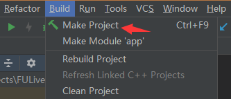

# Android Nama SDK Integration Guide  
Level：Public

Date：2021-01-25

SDK version: 7.3.2

------
## Updates:

**2021-01-25 v7.3.2:**

- Optimize the driving performance of facial expression tracking
- Change fuSetup function to thread-safe
- fuSetUp 、fuCreateItemFromPackage、fuLoadAIModel function increase exception handling, and strengthen robustness
- Fix the the effect of the custom mirror's function
- Fix the crash problem of SDK on MAC 10.11
- Fix the crash problem of SDK when stickers and Animoji are in mixed use

**2020-12-29 v7.3.0:**

- Optimize beauty performance. Compared with v7.2, the frame rate of standard beauty is increased by 29% and 17% in Android and IOS respectively.
- Optimize the performance of body beautification. Compared with v7.2, the performance is improved significantly. The frame rate of Android is increased by 26%, and the CPU is reduced by 32%; the frame rate of IOS increased by 11%, CPU reduced by 46%, and memory reduced by 45%.
- Optimize background segmentation performance. Compared with v7.2, the performance is significantly improved.The frame rate  of Android is increased by 64%, and the CPU is reduced by 25%; The frame rate of IOS is increased by 41%, CPU is reduced by 47%, and memory is reduced by 44%. Please use  ai_human_processor_mb_fast.bundle.
- Optimize the effect of body beautification. When large amplitude motion occures, the problem of great deformation of objects near the head and shoulder is solved. When the human body appears and disappears in the picture, the transition is more natural.Body beautification effect of occlusion is more stable and no high frequency and continuous shaking left.
- Optimize the expression recognition function. Improve the accuracy of recognition. A total of 17 kinds of expression can be recognized, and newly added FUAITYPE_FACEPROCESSOR_EXPRESSION_RECOGNIZER.
- Optimize the green screen matting effect and improve the edge accuracy.
- Optimize the driving effect of facial expression tracking, optimize the slow display of the first frame detection model, strengthen the subtle expression tracking, and optimize the problem that the model becomes smaller when the face rotates.
- Optimize the whole body Avatar tracking driving effect. For continuous high-frequency and large amplitude motion, such as dancing, the overall model stability, especially the arm stability, is improved, and the shaking problem is significantly improved.
- Optimize the problem of eyelid color overflow when eye brightness is used.
- Added face drag deformation function, you can use FUCreator 2.1.0 to edit deformation effect.
- Added thin round eyes in the beauty module. The effect is to make the whole eye enlarged, and the longitudinal amplification is extensively obvious.
- Added support gesture to callback API fuSetHandGestureCallBack. See API document for details.
- Remade the the props of flower control, rain control and snow control so as to solve the problem of incoherent tracking effect.

**Relevant documentations of each function module：**

- [Beautification Filters User Specification](./Beautification_Filters_User_Specification.md)
- [Beautification Filters User Specification_Basic Beautification](./Beautification_Filters_User_Specification_Basic beautification.md)
- [Make Up Parameter Specification](./Make_Up_Parameter_Specification.md)
- [Face Transfer Interface Documentation](./Face_Transfer_Interface_Documentation.md)
- [Emoticon GIF Function Documentation](./Emoticon_GIF_Function_Documentation.md)
- [Light Make Up Function Documentation](./Light_Make_Up_Function_Documentation.md)
- [Hair Beautification Props Function Documentation](./Hair_Beautification_Props_Function_Documentation.md)
- [Body Beautification Props Function Documentation](./Body_Beautification_Props_Function_Documentation.md)
- [Controller Function Documentation](./Controller_Function_Documentation.md)
- [Human Motion Recognition Documentation](./Human_Motion_Recognition_Documentation.md)
- [Greenscreen Function Documentation](./Greenscreen_Function_Documentation.md)

------

## Contents：

[TOC]

------

## 1. Introduction

This document shows you how to integrate the Faceunity Nama SDK into your Android project. 

------

## 2. File structure

This section describes the structure of the Demo file, the various directories, and the functions of important files.

```
+FULiveDemoDroid
  +app 			                           // app
    +src
      +main
        +assets     
          +bg_seg_green                    // green screen matting 
            +sample                        // background resources
            -green_screen.bundle           // matting props
          +change_face                     // poster face change
            +template_xx                   // template resources 
            -change_face.bundle            // poster face change props
          +effect                          // various props
            +animoji                       // Animoji
            +ar                            // AR mask
            +big_head                      // funny big head
            +expression                    // expression recognition
            +facewarp                      // distorting mirror
            +gesture                       // gesture recognition 
            +hair_seg                      // hair beautification props
            +musicfilter                   // music filter
            +normal                        // props stickers 
            +portrait_drive                // portrait drive
            +segment                       // human images segmentation 
            -actiongame_android.bundle     // motion recognition
          +face_beauty_config              // beautification style recommendation
          +light_makeup                    // light makeup
            +blusher...                    // blusher and other resources
            -light_makeup.bundle           // light makeup props
          +makeup                          // makeup
            +combination_bundle            // combination makeup bundle resources
            +config_json                   // combination makeup json resources
            +item_bundle                   // sub-makeup bundle resources
            -color_setup.json              // color configuration
          +pta                             // whole body Avatar
            +boy                           // boy effect props
            +gesture                       // gesture algorithm model
            +girl                          // girl effect props
            -controller_config.bundle      // controller configuration files
            -default_bg.bundle             // white background
        +java                              // Java source code
        +res                               // App resource files

  +faceunity                               // faceunity module
    +libs                                  
      -nama.jar                            // nama.jar
    +src
      +main
        +assets
          +graphic                         // graphic effect props
            -body_slim.bundle              // body beautification props
            -controller.bundle             // whole body Avatar props
            -face_beautification.bundle    // face beautification props
            -face_makeup.bundle            // face makeup props
            -fuzzytoonfilter.bundle        // animation filter props
            -fxaa.bundle                   // 3D rendering anti-aliasing
            -tongue.bundle                 // Tongue tracking data package
          +model                           // algorithm capability model
            -ai_face_processor.bundle      // face recognition AI capability model，which requires default loading
            -ai_face_processor_lite.bundle // face recognition AI capability model，lite version
            -ai_hand_processor.bundle      // gesture recognition AI capability model
			-ai_human_processor.bundle     // human point AI capability model
        +java                              // Java source code
        +jniLibs                           // CNama fuai 库
  +docs		    	                       // contents
  +README.md	 	                       // README
```

------
## 3. Integration

### 3.1 Integration methods

#### 3.1.1 Gradle configurations

Full-function version（physical special effect supported）：

```groovy
implementation 'com.faceunity:nama:7.3.0'
```

Lite version（Smaller size, including face-related functions (except poster face change)）：

```groovy
implementation 'com.faceunity:nama:7.3.0-lite'
```

It is recommended to integrate in this way，which is convinent for subsequent upgrade and maintenance

Downloaded AAR including:

```
    +libs                                  
      -nama.jar                        // JNI API
    +assets
      +graphic                         // graphic effect props
        -body_slim.bundle              // body beautification props
        -controller.bundle             // Avatar props
        -face_beautification.bundle    // face beautification props
        -face_makeup.bundle            // face makeup props
        -fuzzytoonfilter.bundle        // animation filter props
        -fxaa.bundle                   // 3D rendering anti-aliasing
        -tongue.bundle                 // Tongue tracking data package
      +model                           // algorithm capability model
        -ai_face_processor.bundle      // face recognition AI capability model，which requires default loading
        -ai_face_processor_lite.bundle // face recognition AI capability model，lite version
        -ai_hand_processor.bundle      // gesture recognition AI capability model
        -ai_human_processor.bundle     // human point AI capability model
    +jni                               // CNama fuai base
      +armeabi-v7a
        -libCNamaSDK.so
        -libfuai.so
      +arm64-v8a
        -libCNamaSDK.so
        -libfuai.so
      +x86
        -libCNamaSDK.so
        -libfuai.so
      +x86_64
        -libCNamaSDK.so
        -libfuai.so
```

If the so strugture of specified application is needed, please modify app model build.gradle：

```groovy
android {
    // ...
    defaultConfig {
        // ...
        ndk {
            abiFilters 'armeabi-v7a', 'arm64-v8a'
        }
    }
}
```

If the unnecessary assets file need to be eliminated, please modify app model build.gradle：

```groovy
android {
    // ...
    applicationVariants.all { variant ->
        variant.mergeAssetsProvider.configure {
            doLast {
                delete(fileTree(dir: outputDir,
                        includes: ['model/ai_face_processor_lite.bundle',
                                   'model/ai_hand_processor.bundle',
                                   'graphics/controller.bundle',
                                   'graphics/fuzzytoonfilter.bundle',
                                   'graphics/fxaa.bundle',
                                   'graphics/tongue.bundle']))
            }
        }
    }
    // ...
}
```

#### 3.1.2 GitHub download

- Full-function version（physical special effect supported）：[FaceUnity-Android-v7.3.0.tar.gz](https://github.com/Faceunity/FULiveDemoDroid/releases/download/v7.3.0/FaceUnity-Android-v7.3.0.tar.gz)

- Lite version（Smaller size, including face-related functions (except poster face change)）：[FaceUnity-Android-v7.3.0-lite.tar.gz](https://github.com/Faceunity/FULiveDemoDroid/releases/download/v7.3.0/FaceUnity-Android-v7.3.0-lite.tar.gz)

**Library file description：**

1. Library file
  - "libCNamaSDK.so" and "libfuai.so" in "jniLibs" face tracking and props drawing core static library.
  - "nama.jar" in "libs" is a collection of JNI API provided for use.

2. Data files

  - "bundle" in "graphics" is graphic effect props. When necessary, you can create props to use it.

  - "bundle" in "model" is algorithm capability model. After the SDK is initialized, the AI capabilities that may be used can be loaded on demand.
  - "\*.bundle" in "effects" is special effect sticker props created by our company. If you need to make custom special effects stickers, please contact our company for relevant tools and instructions.

**Note：** These data files are binary data, independent of the extension. In actual use, you can package the data package in the application or download it through the network, as long as the correct array of file bytes is passed in in the function interface.

### 3.2 Development environment

#### 3.2.1 Platform
```
Android API 19 or above
```
#### 3.2.2 Development environment
```
Android Studio 3.4 or above，Open GLES 2.0 or above
```

### 3.3 Preparing 

- Download [FULiveDemoDroid](https://github.com/Faceunity/FULiveDemoDroid) 
- Get certificates:
  1. call **0571-88069272** 	
  2. send mail to **marketing@faceunity.com** 

### 3.4 Configurations

The certificate issued by the Android platform is the authpack.java file. If you have obtained the authentication certificate, put the certificate file in the project faceunity module com.faceunity.fulivedemo package.

- Click the Sync button , or Build-->Make Projects.



- Click the Run button，deployed to the phone.


### 3.5 initialization

Initialize SDK environment, load SDK data and perform authentication. Initialization must be performed before other interface, otherwise it will lead to an exception.

```java
public static native int fuSetup(byte[] v3data, byte[] authdata);
```

Parameter description:

`v3data` send null bytes array

`authdata` secret key array. It must be set properly so SDK can work normally

Example code：

```java
int isSetup = faceunity.fuSetup(new byte[0], authpack.A());
Log.d(TAG, "fuSetup. isSetup: " + (isSetup == 0 ? "no" : "yes"));
```
Notes：only needs to be setup once after startup, where the authpack.A() key array is declared in authpack.java.

### 3.6 Prop Item Creation, Destruction and Switching

#### 3.6.1 Prop Item Creation

**Prop item creation interface：**

```java
public static native int fuCreateItemFromPackage(byte[] data);
```

**Parameter description：**

`data` prop item binary data

**Return value：**

`int` prop handle

Sometimes in practical application multiple prop items will be utilized at the same time, in that case parameter that Nama SDK's video processing interfaces accept is a int array including multiple prop item handles, so we need to creat a int array to store these prop item handles. Next we will create a face beautification prop item handle and store it in position ITEM_ARRAYS_EFFECT in int array. **Example code as below:**

```java
InputStream is = mContext.getAssets().open(bundle.path());
byte[] itemData = new byte[is.available()];
int len = is.read(itemData);
is.close();
mItemsArray[ITEM_ARRAYS_EFFECT_INDEX] = faceunity.fuCreateItemFromPackage(itemData);
updateEffectItemParams(mItemsArray[ITEM_ARRAYS_EFFECT_INDEX]);//update props' parameter
```

#### 3.6.2 Prop Item Destruction

**Single Prop Item Destruction：**

```java
public static native void fuDestroyItem(int item);
```

**Parameter description：**

`item ` prop item handle to be destroyed

This interface will release resource corresponding to imported handle. Example code as below：

```java
if (mItemsArray[ITEM_ARRAYS_EFFECT] > 0)
    faceunity.fuDestroyItem(mItemsArray[ITEM_ARRAYS_EFFECT]);
```

**All Prop Items Destruction：**

```java
public static native void fuDestroyAllItems();
```

This interface can destroy resources corresponding to all prop item handle, please set this handle to 0 after processing as well. **Example code as below:**

```java
Arrays.fill(mItemsArray, 0);
faceunity.fuDestroyAllItems();
```

#### 3.6.3 Prop Item Switching

If certain position of handle array needs to be switched, new prop item handle needs to be created first, and then switch this handle with the one needs to be replaced, at last destroy replaced handle. Below is an example of replacing the position ITEM_ARRAYS_EFFECT handle of handle array:

```java
final Effect effect = (Effect) msg.obj;
final int newEffectItem = loadItem(effect);
queueEvent(new Runnable() {
    @Override
    public void run() {
        if (mItemsArray[ITEM_ARRAYS_EFFECT_INDEX] > 0) {
            faceunity.fuDestroyItem(mItemsArray[ITEM_ARRAYS_EFFECT_INDEX]);
            mItemsArray[ITEM_ARRAYS_EFFECT_INDEX] = 0;
        }
        mItemsArray[ITEM_ARRAYS_EFFECT_INDEX] = newEffectItem;
        setMaxFaces(effect.maxFace());
    }
});
```

Due to the asynchronous loading, this demo uses queueEvent  to update the handle. (The queueEvent mechanism is the same as the queueEvent mechanism of GLSurfaceView)

Notes: If you destroy the old props first, and then create new props, you may have a stuttering phenomenon.

### 3.7 Algorithm model loading and destroying

#### 3.7.1 Algorithm model loading

**Load algorithm model API：**

```java
public static native int fuLoadAIModelFromPackage(byte[] data, int type);
```

**Parameter description：**

`data` Model binary data

`type` FUAITYPE_XXX，see Java API reference documents for more details.

**Return value：**

`int` 1 represents success，0 represents failure.

Load one time when Surface is creating. Time-consuming operation. It can be loaded asynchronously. GL environment is not necessary.

```java
    private static void loadAiModel(Context context, String bundlePath, int type) {
        byte[] buffer = readFile(context, bundlePath);
        if (buffer != null) {
            int isLoaded = faceunity.fuLoadAIModelFromPackage(buffer, type);
            Log.d(TAG, "loadAiModel. type: " + type + ", isLoaded: " + (isLoaded == 1 ? "yes" : "no"));
        }
    }
```

#### 3.7.2 Algorithm model destroying

**Destroy algorithm model API：**

```java
public static native int fuReleaseAIModel(int type);
```

**Parameter description：**

`type` FUAITYPE_XXX，see Java API reference documents for more details.

**Return value：**

`int`  1 represents success，0 represents failure.

Release memory occupied by algorithm model when Surface is destroying.It can be called asynchronously，not time-consuming. GL environment is not necessary.

```java
    private static void releaseAiModel(int type) {
        if (faceunity.fuIsAIModelLoaded(type) == 1) {
            int isReleased = faceunity.fuReleaseAIModel(type);
            Log.d(TAG, "releaseAiModel. type: " + type + ", isReleased: " + (isReleased == 1 ? "yes" : "no"));
        }
    }
```

### 3.8 Video Processing

Send video image data and prop item handle together to Nama SDK's rendering interfaces and prop items' effect will be rendered to video image after rendering process.

#### 3.8.1 Video Image Rendering Dual Input Interface

```java
public static native int fuDualInputToTexture(byte[] img, int tex_in, int flags, int w, int h, int frame_id, int[] h);
```

**Parameter description：**

`img` :video image data byte[], support NV21(default), I420SP, RGBA format

`tex_in` video image texture ID

`flags` flags, may specify img data format, return texture ID's prop item mirroring and so on

`w` :video image data's width

`h` :video image data's height

`frame_id`: current processing video frame's serial number

`items` :int array including multiple prop item handle

**Return value:**：

`int `  :processed video image data texture ID

Example code as below:

```java
int flags = mInputTextureType | mInputImageFormat;
if (mCurrentCameraType != Camera.CameraInfo.CAMERA_FACING_FRONT)
    flags |= FU_ADM_FLAG_FLIP_X;
int fuTex = faceunity.fuDualInputToTexture(img, tex, flags, w, h, mFrameId++, mItemsArray);
```

#### 3.8.2 Video Image Rendering Single Input Interface

```java
public static native int fuRenderToNV21Image(byte[] img, int w, int h, int frame_id, int[] items, int flags);
```

**Parameter description：**

`img ` :video image data byte[], processed image data will be written back to this byte[]

`w` :video image data's width

`h` :video image data's height

`frame_id` :current processing video frame's serial number

`items` :int array including multiple prop item handle

`flags` flags, may specify img data format, return texture ID's prop item mirroring and so on

**Return value：**

`int ` :processed video image data texture ID

Example code as below：

```java
int flags = mInputImageFormat;
if (mCurrentCameraType != Camera.CameraInfo.CAMERA_FACING_FRONT)
    flags |= FU_ADM_FLAG_FLIP_X;
int fuTex = faceunity.fuRenderToNV21Image(img, w, h, mFrameId++, mItemsArray, flags);
```
------

## 4. Function
### 4.1 Face Beautification

**Beautification**

Configuration of face beautification function is similar to that of adding special effect prop items to video image, create face beautification prop handle first and then save it in handle array.

**Example code：**

```java
InputStream beauty = mContext.getAssets().open(BUNDLE_face_beautification);
byte[] beautyData = new byte[beauty.available()];
beauty.read(beautyData);
beauty.close();
mItemsArray[ITEM_ARRAYS_FACE_BEAUTY_INDEX] = faceunity.fuCreateItemFromPackage(beautyData);
```

When processing video image, beautification prop item handle will be imported to video image rendering interface through handle array, face beautification effect will be added to original video image after rendering. 

Example code as below：

```java
//mItemsArray is an int array that carries the handle
int fuTex = faceunity.fuDualInputToTexture(img, tex, flags, w, h, mFrameId++, mItemsArray);
```

**Parameter Configuration**
Face beautification prop item mainly contain nine modules: filter, skin whitening, ruddy, blur, sharpening, eye brighten, tooth whiten, remove black eye, remove nasolabial folds, face outline beautification. Each module has its default effect, parameters which can be adjusted are as belows:

#### 4.1.1 Filter

The filter function is mainly controlled by the parameters `filter_level` and `filter_name`.

`filter_name` refer to the documentation：[Face Beautification Props Function Documentation](Face_Beautification_Props_Function_Documentation.md) ，detailed description of the corresponding key value of the filter.

`filter_level` value range 0.0-1.0, 0.0 is no effect, 1.0 is maximum effect, default value is 1.0, sample code

**Example code：**

```java
faceunity.fuItemSetParam(mItemsArray[ITEM_ARRAYS_FACE_BEAUTY_INDEX], "filter_level", mFilterLevel);
```

`filter_name` : The value is a string. The default value is  “`origin`”, which is the use of the original image effect.

**Example code：**

```java
faceunity.fuItemSetParam(mItemsArray[ITEM_ARRAYS_FACE_BEAUTY_INDEX], "filter_name", mFilterName);
```

#### 4.1.2 Skin Whitening & Ruddy

##### Skin Whitening

Skin Whitening is mainly controlled by parameter `color_level`. 

`color_level` value ranges from 0.0 to 1.0. 0.0 is no effect, 1.0 is the maximum effect, and the default value is 0.2.

**Example code：**

```java
faceunity.fuItemSetParam(mItemsArray[ITEM_ARRAYS_FACE_BEAUTY_INDEX], "color_level", mFaceBeautyColorLevel);
```

##### Ruddy

Ruddy is mainly controlled by the parameter `red_level`.

`red_level` ranges from 0.0-1.0. 0.0 is no effect, 1.0 is maximum effect, and the default value is 0.5.

**Example code：**

```java
faceunity.fuItemSetParam(mItemsArray[ITEM_ARRAYS_FACE_BEAUTY_INDEX], "red_level", mFaceBeautyRedLevel);
```

#### 4.1.3 Blur

There are 4 parameters to control skin blur：`blur_level`，`skin_detect`，`nonshin_blur_scale`，`heavy_blur`.

- `blur_level`: specifies blur level. This parameter's recommended value range is 0~6，and the default value is 6.0
- `skin_detect`: specifies whether enable skin detection，0 is on ，1 is off
- `nonskin_blur_scale`: specifies non skin area blur weaken level when enable skin detection，This parameter's range is 0~1，the default value is 0.45
- `heavy_blur`: specifies whether enable heavy blur function，0 is light blur，1 is heavy blur.

**Example code：**

```java
faceunity.fuItemSetParam(mItemsArray[ITEM_ARRAYS_FACE_BEAUTY_INDEX], "skin_detect", mFaceBeautyALLBlurLevel);
faceunity.fuItemSetParam(mItemsArray[ITEM_ARRAYS_FACE_BEAUTY_INDEX], "heavy_blur", mFaceBeautyType);
faceunity.fuItemSetParam(mItemsArray[ITEM_ARRAYS_FACE_BEAUTY_INDEX], "blur_level", 6 * mFaceBeautyBlurLevel);
faceunity.fuItemSetParam(mItemsArray[ITEM_ARRAYS_FACE_BEAUTY_INDEX], "nonshin_blur_scale", 0.45);
```

#### 4.1.4 Eye Brighten

Eye Brighten is mainly controlled by parameter `eye_bright`.

`eye_bright`: this parameter's recommended value range is 0~1. 1.0 is the maximum effect, and the default value is 1.0.

**Example code：**

```java
faceunity.fuItemSetParam(mItemsArray[ITEM_ARRAYS_FACE_BEAUTY_INDEX], "eye_bright", mBrightEyesLevel);
```

#### 4.1.5 Tooth Whiten

Tooth Whiten is mainly controlled by the parameter `tooth_whiten`.

`tooth_whiten` : This parameter's recommended value range is 0~1. 1.0 is the maximum effect, and the default value is 1.0.

**Example code：**

```java
faceunity.fuItemSetParam(mItemsArray[ITEM_ARRAYS_FACE_BEAUTY_INDEX], "tooth_whiten", mBeautyTeethLevel);
```

#### 4.1.6 Face Outline Beautification

There are four basic beautification types: Goddess, cyber celebrity, nature, default and one advanced face beautification type: custom, which specified by parameter `face_shape`: Goddess(0),cyber celebrity(1), nature(2), default(3) and custom(4).


```java
faceunity.fuItemSetParam(mItemsArray[ITEM_ARRAYS_FACE_BEAUTY_INDEX], "face_shape", mFaceBeautyFaceShape);
```

Based on above mentioned four basic face outline beautification and one advanced face outline beautification, we provide following three parameters: `face_shape_level`, `eye_enlarging`, `cheek_thinning` in addition.

```face_shape_level``` controls levels changing to specified basic face shape. This parameter's recommended value range is 0~1 which 0 stands for no effect,  disable face outline beautification，1.0 is the maximum effect, the default value is 1.0.

```java
faceunity.fuItemSetParam(mItemsArray[ITEM_ARRAYS_FACE_BEAUTY_INDEX], "face_shape_level", mFaceShapeLevel);
```

The parameter eye_enlarging is used to control the size of the eye. This parameter is affected by the parameter face_shape_level. The recommended value range for this parameter is [0, 1]. Greater than 1 is the enhancement effect, the default is 0.5.

```java
faceunity.fuItemSetParam(mItemsArray[ITEM_ARRAYS_FACE_BEAUTY_INDEX], "eye_enlarging", mFaceBeautyEnlargeEye);
```

The parameter cheek_thinning is used to control the size of the face. This parameter is affected by the parameter face_shape_level. The recommended value range for this parameter is [0, 1]. Greater than 1 is the enhancement effect, the default is 0.5.

```java
faceunity.fuItemSetParam(mItemsArray[ITEM_ARRAYS_FACE_BEAUTY_INDEX], "cheek_thinning", mFaceBeautyCheekThin);
```

##### Advanced Face Outline Beautification

**face outlines adjustment**

Added optimized face-lifting and big-eye effects, increased forehead adjustment, chin adjustment, thin nose, and mouth shape adjustment. 4 face_shape is set to 4 to enable fine face adjustment. FULiveDemo can be selected from the face. Define to turn on fine face adjustment.

__Instructions__：
- loading face_beautification.bundle
- setting the following parameter:
  `face_shape`: 4,   // 4 is enable advance function，0～3 is basic function

**Face-lifting**

Optimize the effect, more natural than before

__Instructions__：

- loading face_beautification.bundle
- setting the following parameter:
  `face_shap`e: 4,   // 4 is enable advance function，0～3 is basic function
  `cheek_thinning`: 0.0,   // Use the original parameter cheek_thinning to control face-lifting, range 0 - 1, default 0.0

**Eye Brighten**

Optimize eye brighten effect , more natural than before

__Instructions__：
- loading face_beautification.bundle
- setting the following parameter:
  `face_shape`: 4,   // 4 is enable advance function，0～3 is basic function
  `eye_enlarging`: 0.0,   // Use the original parameter eye_enlarging to control large eyes, range 0 - 1, default 0.5

**Forehead adjustment**

A new beauty prop that can adjust the forehead size

__Instructions__：
- loading face_beautification.bundle
- setting the following parameter:
  `face_shape`: 4,   // 4 is enable advance function，0～3 is basic function
  `intensity_forehead`: 0.5,   // Greater than 0.5 becomes larger, less than 0.5 becomes smaller, default is 0.5

**Chin adjustment**

A new beauty prop that can adjust the chin size

__Instructions__：
- loading face_beautification.bundle
- setting the following parameter:
  `face_shape`: 4,   // 4 is enable advance function，0～3 is basic function
  `intensity_chin`: 0.5,   // Greater than 0.5 becomes larger, less than 0.5 becomes smaller, default is 0.5

**Thin nose**

A new beauty prop that can adjust the thin size

__Instructions__：
- loading face_beautification.bundle
- setting the following parameter:
  `face_shape`: 4,   //4 is enable advance function，0～3 is basic function
  `intensity_nose`: 0.0,   // 0 is the normal size, greater than 0 starts thin nose, range 0 - 1, default 0.0

**Mouth adjustment**

A new beauty prop that can adjust the mouth size

__Instructions__：
- loading face_beautification.bundle
- setting the following parameter:
  `face_shape`: 4,   // 4 is enable advance function，0～3 is basic function
  `intensity_mouth`: 0.5,   // Greater than 0.5 becomes larger, less than 0.5 becomes smaller, default is 0.5

**Example code：**

```java
            faceunity.fuItemSetParam(mItemsArray[ITEM_ARRAYS_FACE_BEAUTY_INDEX], "face_shape_level", mFaceShapeLevel);
            faceunity.fuItemSetParam(mItemsArray[ITEM_ARRAYS_FACE_BEAUTY_INDEX], "face_shape", mFaceShape);
            faceunity.fuItemSetParam(mItemsArray[ITEM_ARRAYS_FACE_BEAUTY_INDEX], "eye_enlarging", mEyeEnlarging);
            faceunity.fuItemSetParam(mItemsArray[ITEM_ARRAYS_FACE_BEAUTY_INDEX], "cheek_thinning", mCheekThinning);
            faceunity.fuItemSetParam(mItemsArray[ITEM_ARRAYS_FACE_BEAUTY_INDEX], "intensity_chin", mIntensityChin);
            faceunity.fuItemSetParam(mItemsArray[ITEM_ARRAYS_FACE_BEAUTY_INDEX], "intensity_forehead", mIntensityForehead);
            faceunity.fuItemSetParam(mItemsArray[ITEM_ARRAYS_FACE_BEAUTY_INDEX], "intensity_nose", mIntensityNose);
            faceunity.fuItemSetParam(mItemsArray[ITEM_ARRAYS_FACE_BEAUTY_INDEX], "intensity_mouth", mIntensityMouth);
```

**Notes：** Deformation is a high level face beautification function. In order to use it，you need to get the corresponding certificate permission.

For the additional functions, please see [Face Beautification Props Function Documentation](./Face_Beautification_Props_Function_Documentation.md).

------

### 4.2 Gesture Recognition

Gesture recognition function is realized by loading prop item as well currently. Gesture recognition prop items cotain gesture to be recognized, animation effect triggered when gesture recognized and control script. Loading process is same with that of common prop items and face beautification prop item.

ssd_thread_korheart.bundle in demo is single hand love heart gesture prop item.Load it as prop item to render shall enable gesture recognition function. Gesture recognition prop item can exist with common and face beautification prop item at the same time, just like expand mItemsArray to three in face beautification and load gesture recognition prop item at last.

Process of customize gesture prop is same with that of 2D prop item, please contact Faceunity technical support for details.

------

### 4.3 3D Render Anti-Aliasing Function

High efficient full screen anti-aliasing, makes 3D render effect smoother.

__Instructions__：

- load fxaa.bundle，distributed together with Nama SDK
- Put fxaa.bundle at the last position of prop item array while rendering

```
InputStream animoji3D = mContext.getAssets().open(BUNDLE_animoji_3d);
byte[] animoji3DData = new byte[animoji3D.available()];
animoji3D.read(animoji3DData);
animoji3D.close();
mItemsArray[ITEM_ARRAYS_EFFECT_ABIMOJI_3D] = faceunity.fuCreateItemFromPackage(animoji3DData);
```

### 4.4 Dynamic Portrait Function

- Performe accurate face rebuild through photograph, then it will support real time face expression driving and preset face expression play. It can be used in real time application or be used to creat face expression package.

This function contains two methods to creat resources:

- Utilize FUEditor v4.3.0 and above to creat off line props

- Utilize cloud service provided by Faceunity to upload photograph to creat props in real time.

Please contact our technical support to get detailed information about cloud service.

Instructions:

- Load corresponding prop item directly
- Certificate that possess Dynamic Portrait privilege is needed

### 4.5 Face Warp Function

Added 5 exaggeration transformation(Face Warp Function) prop items.

__Instructions__：

- Load corresponding props directly
- Certificate that possess photograph driving privilege is needed

### 4.6 Music Filter

Music filter is powered by time-stamp of playing music,  it can be utilized by introducing music playing course to music filter prop item every time processing video image, example code as below:

```java
faceunity.fuItemSetParam(mItemsArray[ITEM_ARRAYS_EFFECT_INDEX], "music_time", time);
```

You can simulate music playing course if there is no music. Prop item in demo corresponds to music of 28s(28000ms) in length, time counting can be started from loading music filter prop item, get time difference between current time and time when starting loading music filter every time before processing video image and convert it into ms, set time to 0 when time difference is over 28000ms. You can check FULiveDemo for effect and create one utilizing FUEditor(v4.2.1 and above).

### 4.7 Avatar Pinch function

The Nama SDK supports the Avatar pinch feature from 6.0.0.

The virtual character supports the pinch function. By using the bundle generated by the FUEditor 6.0.0 template facepup, the corresponding parameters can be adjusted on the client side, so that the user can customize the face, hairstyle, lip color and other parts, generate and save the avatar desired by the user. The avatar can be driven by the engine in real time according to the face, and the expression is synchronized with the face.

After loading the prepared pinch props, you can set the following parameters to pinch the face.

**Enter the pinch state**

```java
//Enter the pinch state
faceunity.fuItemSetParamd(mItemsArray[ITEM_ARRAYS_EFFECT_INDEX],"enter_facepup",1);
```

**Clear all pinch parameters**

```java
//Clear all pinch parameters
faceunity.fuItemSetParamd(mItemsArray[ITEM_ARRAYS_EFFECT_INDEX],"clear_facepup",1);
```

**Set the pinch parameter**

```java
//Set the weight of the first pinch attribute "big eye", the range [0-1]. param corresponds to the first pinch face attribute here, starting from 1.
faceunity.fuItemSetParamd(mItemsArray[ITEM_ARRAYS_EFFECT_INDEX],"\{\"name\":\"facepup\",\"param\":\"1\"\}",1);

//Set the weight of the second pinch attribute "tip chin", range [0-1]. param corresponds to the first pinch face attribute here, starting from 1.
faceunity.fuItemSetParamd(mItemsArray[ITEM_ARRAYS_EFFECT_INDEX],"\{\"name\":\"facepup\",\"param\":\"2\"\}",0.5);
```

**Save or Exit**

Choose one of the two

```java
//1. Directly exit the pinch state, do not save the current pinch state, and enter the tracking state. Use the last pinch face to track facial expressions.
faceunity.fuItemSetParamd(mItemsArray[ITEM_ARRAYS_EFFECT_INDEX],"quit_facepup",1);
//2. Trigger to save the pinch face, and exit the pinch state, enter the tracking state. Time-consuming operation, set if necessary.
fuItemSetParamd(mItemsArray[ITEM_ARRAYS_EFFECT_INDEX],"need_recompute_facepup",1);
```

### 4.8 Comic Filter + Animoji in AR Mode

**Comic Filter**

Comic Filter is filter in comic style, utilizing method is same with common prop item, just load and save it in prop item handle array and then introduce to video image processing interface. In our demo, we utilize comic filter with Animoji in AR mode, but it's not limited in this kind of utilization, you can also utilize it alone or with any other prop item together. Please pay attention that Nama SDK will set comic filter's 'glVer' property according to current OpenGL ES version. Only utilizing OpenGL ES 3.0 can get good comic filter effect, below versions may cause bad effect. Setting method code as below:

```java
faceunity.fuItemSetParam(itemHandle, "glVer", 3); // 2 stands for compatibility mode, 3 stands for normal mode.
```

**Animoji in AR Mode**

Unlike Animoji in normal mode, AR mode will show reality scenes and Animoji will move following face to add more interactivities. Utilizing Animoji in AR mode together with comic filtetr can make Animoji and reality scene's style unitive and blend very natural. Animoji in AR mode setting method code as below: 

```java
// Set Animoji to follow the face
faceunity.fuItemSetParam(itemHandle, "{\"thing\":\"<global>\",\"param\":\"follow\"}", 1); // A value of 1 means open, and a value of 0 means closed.
```

Set props'parameter to tacle mirroring issue of Animoji when switch the camera. Setting method as below:

```java
int back = mCurrentCameraType == Camera.CameraInfo.CAMERA_FACING_BACK ? 1 : 0; 
// mirrored vertex
faceunity.fuItemSetParam(itemHandle, "is3DFlipH", back);
// mirrored expression
faceunity.fuItemSetParam(itemHandle, "isFlipExpr", back);        
// mirrored tracking（shift and rotation）
faceunity.fuItemSetParam(itemHandle, "isFlipTrack", back);
// mirrored light
faceunity.fuItemSetParam(itemHandle, "isFlipLight ", back);
```

### 4.9 Tongue Driving

Nama SDK started supporting tongue driving function from v5.6. When utilizing prop item with tongue effect, loading tongue driving data model first is necessary and loading method code is as below:

```java
InputStream tongue = context.getAssets().open(BUNDLE_tongue);
byte[] tongueDate = new byte[tongue.available()];
tongue.read(tongueDate);
tongue.close();
faceunity.fuLoadTongueModel(tongueDate);
```

### 4.10 Face Fusion

Nama SDK started supporting face fusion function from v5.8. This function can perform fusion effect of user's face to model's face in the poster to realize face transfer effect.

First load change_face.bundle, and then please refer to [Face Transfer Interface Documentation](./Face_Transfer_Interface_Documentation.md)，also you can refer to our demo.


### 4.11 Make Up

Nama SDK started supporting new version make up function from v5.8. This function can add lip, blush, eye brow, eye shadow, eye liner,  eyelash and eye pupil effects and support exquisite modification.

First load face_makeup.bundle, and then please refer to[Make Up Parameter Specification](./Make_Up_Parameter_Specification.md)，also you can refer to our demo.

### 4.12 Hair Color

The Nama SDK supports the hairdressing function from 5.8.0. This function can change the hair color of the characters. Currently, it supports 8 kinds of common hair color and 5 kinds of gradient colors, and adjusts the hairdressing degree.

#### common hair color

First load hair_color.bundle, then use the parameter Index to switch the color. The recommended value range of this parameter is 0~7. The intensity of the hair color can be adjusted by the parameter Strength. The recommended value range of this parameter is 0~1. Example code:

```java
/**Set hairdressing parameters**/
faceunity.fuItemSetParam(mItemsArray[ITEM_ARRAYS_EFFECT_HAIR_NORMAL_INDEX], "Index", mHairColorIndex);
                    faceunity.fuItemSetParam(mItemsArray[ITEM_ARRAYS_EFFECT_HAIR_NORMAL_INDEX], "Strength", mHairColorStrength);
```

#### Gradient color

First load hair_gradient.bundle, then use the parameter Index`` to switch the color. The recommended value range of this parameter is 0~4. The intensity of the hair color can be adjusted by the parameter Strength. The recommended value range of this parameter is 0~1. Example code:

```java
/**Set hairdressing parameters**/
faceunity.fuItemSetParam(mItemsArray[ITEM_ARRAYS_EFFECT_HAIR_GRADIENT_INDEX], "Index", mHairColorIndex);
                    faceunity.fuItemSetParam(mItemsArray[ITEM_ARRAYS_EFFECT_HAIR_GRADIENT_INDEX], "Strength", mHairColorStrength);
```

### 4.13 Light makeup function

The Nama SDK supports texture and beauty features starting with 6.0.0.

The Light makeup is a more sophisticated and efficient beauty solution, which includes four modules: blur, beauty, filter and beauty. It provides 60+ sets of rich material library to support customers to switch styles and effects.

First load light_makeup.bundle, then set parameters such as blush, eye shadow, eyeliner, lipstick, etc.，and you can refer to our sample code in FULiveDemo.

### 4.14 Body beautification function

The Nama SDK supports Beauty and slimming function starting with 6.4.0，including slimming, long legs, buttocks, waist, shoulder adjustment, etc. Only support single person.

First load BodySlim.bundle，then set parameters such as slimming, long legs, buttocks, waist, shoulder adjustment, etc. See parameter description in [Body Beautification Props Function Documentation](./Body_Beautification_Props_Function_Documentation.md) and the example code in our demo.

### 4.15 Whole body Avatar function

The Nama SDK supports Whole body Avatar function starting with 7.0.0. It supports full body / half body driving of virtual image and accurate gesture recognition. Please see [controller function documentation](./controller_function_documentation.md), and the example code in our demo for usage methods.

------

## 5. FAQ 

### Confusion rule

```
-keep class com.faceunity.wrapper.faceunity {*;}
-keep class com.faceunity.wrapper.faceunity$* {*;}
```

**Any problems, please feel free to contact our technical support, thank you !**